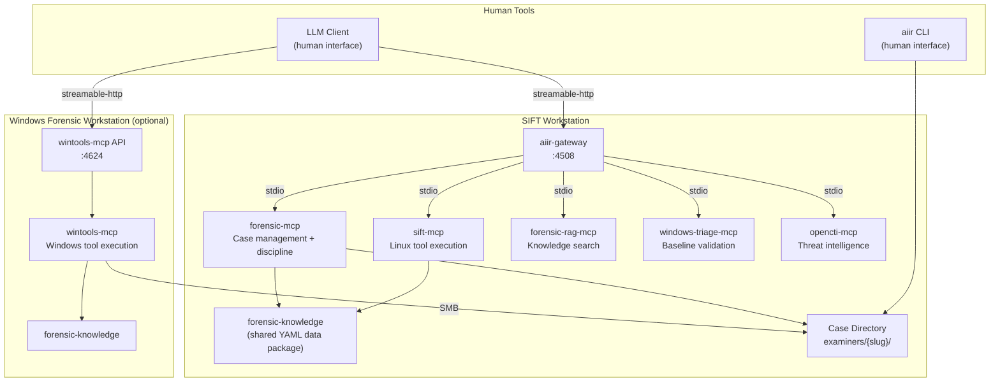
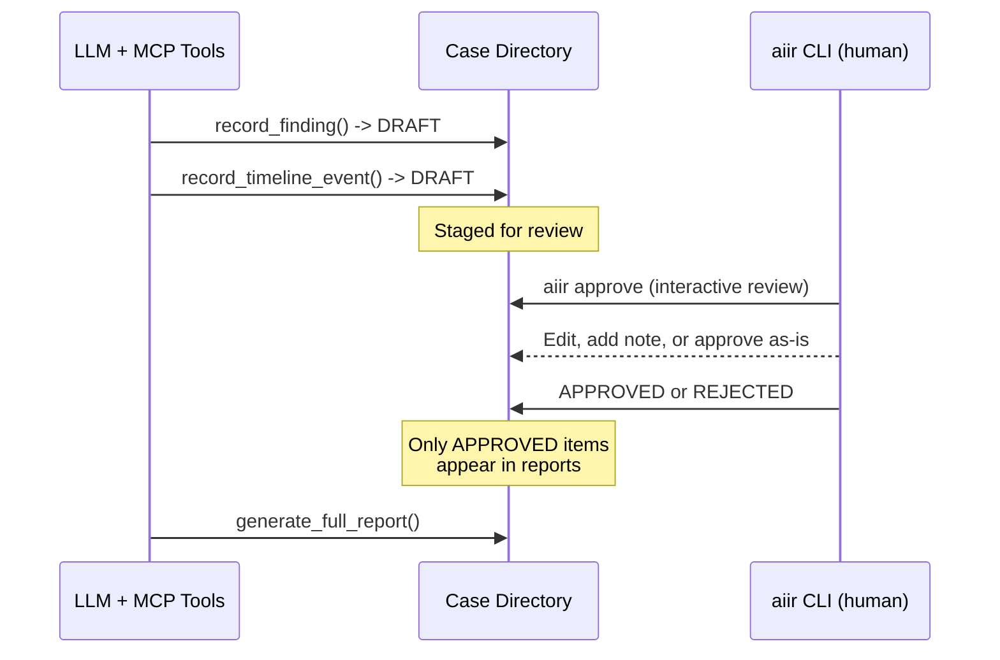
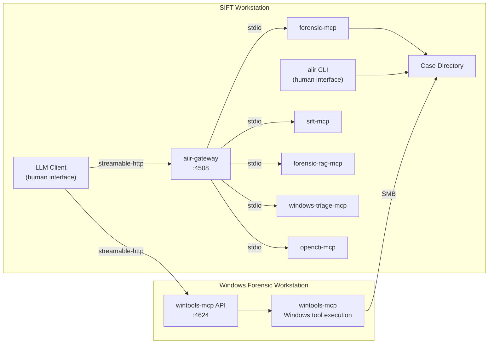
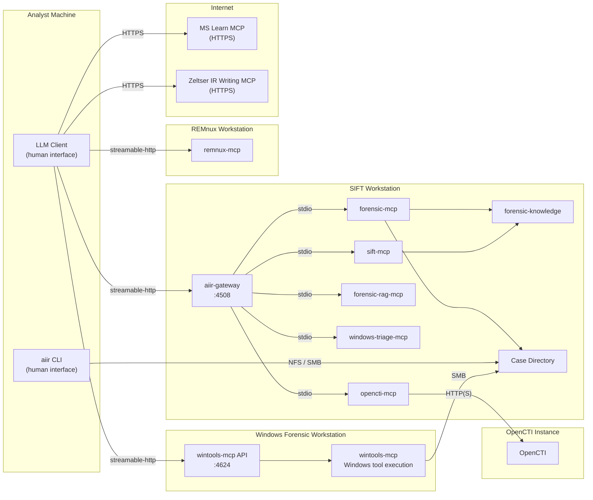
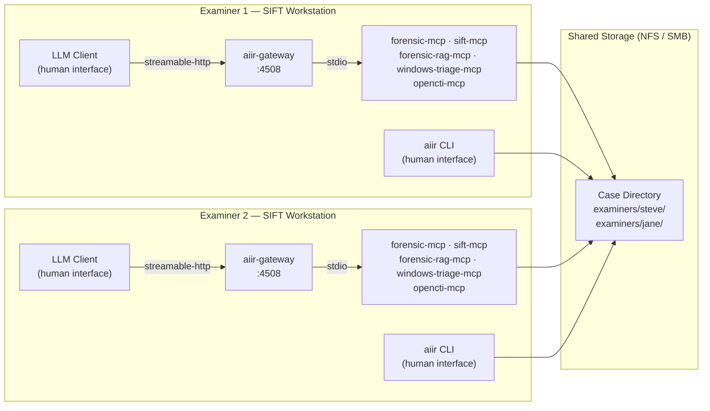

# AIIR

AI-assisted incident response platform -- CLI, installers, and architecture reference.

## Platform Architecture

AIIR is an LLM-agnostic forensic investigation platform built on the Model Context Protocol (MCP). Any MCP-compatible orchestrator works: Claude Code, Cursor, Claude Desktop, OpenWebUI, Goose, OpenCode, and others. The LLM client and the aiir CLI are the two human-facing tools -- they always run on the same machine (the SIFT workstation).

### Core Component Map



### Human-in-the-Loop Workflow

All findings and timeline events are staged as DRAFT by the AI. Only a human examiner can approve or reject them via the `aiir` CLI. The CLI reads confirmation from `/dev/tty`, which the AI cannot control.



### Where Things Run

| Component | Runs on | Port | Purpose |
|-----------|---------|------|---------|
| aiir-gateway | SIFT | 4508 | Aggregates SIFT-local MCPs behind one HTTP endpoint |
| forensic-mcp | SIFT | (via gateway) | Case management, findings, timeline, evidence, discipline, reports |
| sift-mcp | SIFT | (via gateway) | Catalog-gated forensic tool execution on Linux/SIFT |
| forensic-rag-mcp | SIFT | (via gateway) | Semantic search across Sigma, MITRE ATT&CK, Atomic Red Team, and more |
| windows-triage-mcp | SIFT | (via gateway) | Offline Windows baseline validation |
| opencti-mcp | SIFT | (via gateway) | Threat intelligence from OpenCTI |
| wintools-mcp | Windows | 4624 | Catalog-gated forensic tool execution on Windows |
| aiir CLI | SIFT | -- | Human-only: approve/reject findings, review cases, manage evidence |
| forensic-knowledge | anywhere | -- | Pip-installable YAML data package (tools, artifacts, discipline) |

### Deployment Topologies

#### Solo Analyst on SIFT


#### SIFT + Windows Forensic Workstation



#### With Optional External MCPs



#### Multi-Examiner Team



### Case Directory Structure

```
cases/INC-2026-0219/
├── CASE.yaml                    # Case metadata (name, mode, team)
├── evidence/                    # Original evidence (read-only after registration)
├── extracted/                   # Extracted artifacts
├── reports/                     # Generated reports
└── examiners/
    ├── steve/                   # Examiner "steve"
    │   ├── findings.json        # Findings (DRAFT -> APPROVED/REJECTED)
    │   ├── timeline.json        # Timeline events
    │   ├── todos.json           # Investigation TODOs
    │   ├── evidence.json        # Evidence registry
    │   ├── actions.jsonl        # Investigative actions (append-only)
    │   ├── evidence_access.jsonl # Chain-of-custody log
    │   ├── approvals.jsonl      # Approval audit trail
    │   └── audit/
    │       ├── forensic-mcp.jsonl
    │       ├── sift-mcp.jsonl
    │       └── ...
    └── jane/                    # Examiner "jane" (same structure)
        └── ...
```

## Quick Start

### SIFT Workstation

```bash
git clone https://github.com/AppliedIR/aiir.git && cd aiir
./scripts/setup-sift.sh
```

Three installer modes:

```bash
./scripts/setup-sift.sh --quick -y --examiner=steve --client=claude-code   # unattended, core MCPs
./scripts/setup-sift.sh --recommended -y --examiner=steve                  # adds RAG + triage
./scripts/setup-sift.sh                                                    # interactive wizard
```

### Windows Forensic Workstation (optional)

```powershell
git clone https://github.com/AppliedIR/aiir.git; cd aiir
.\scripts\setup-windows.ps1
```

Then configure your LLM client to connect to both endpoints:

```bash
aiir setup client --sift=SIFT_IP:4508 --windows=WIN_IP:4624
```

### First Investigation

```bash
aiir case init "Ransomware Investigation"
# ... AI stages findings via MCP tools ...
aiir approve    # Interactive review of AI-staged findings
```

## Security Considerations

All AIIR components are assumed to run on a private forensic network, protected by firewalls, and not exposed to incoming connections from the Internet or potentially hostile systems. The design assumes dedicated, isolated systems are used throughout.

Any data loaded into the system or its component VMs, computers, or instances runs the risk of being exposed to the underlying AI. Only place data on these systems that you are willing to send to your AI provider.

While outgoing connections to the Internet are used for some optional components (OpenCTI, MS Learn MCP, Zeltser IR Writing MCP), no incoming connections from external systems should be allowed.

## Commands

### case

```bash
aiir case init "Ransomware Investigation"                # Solo case
aiir case init "Team Investigation" --collaborative      # Multi-examiner case
aiir case join --case-id INC-2026-02191200               # Join existing case
```

### approve

```bash
aiir approve                                             # Interactive review of all DRAFT items
aiir approve F-001 F-002 T-001                           # Approve specific IDs
aiir approve F-001 --edit                                # Edit in $EDITOR before approving
aiir approve F-001 --note "Malware family unconfirmed"   # Approve with examiner note
aiir approve --by jane                                   # Review only jane's findings
aiir approve --findings-only                             # Skip timeline events
aiir approve --timeline-only                             # Skip findings
```

### reject

```bash
aiir reject F-003 --reason "Insufficient evidence for attribution"
aiir reject F-003 T-002 --reason "Contradicted by memory analysis"
```

### review

```bash
aiir review                                # Case summary (counts by status)
aiir review --findings                     # Findings table
aiir review --findings --detail            # Full finding detail
aiir review --findings --verify            # Cross-check against approval records
aiir review --iocs                         # IOCs grouped by approval status
aiir review --timeline                     # Timeline events
aiir review --evidence                     # Evidence registry and access log
aiir review --audit --limit 100            # Audit trail (last N entries)
aiir review --todos --open                 # Open TODOs across all examiners
```

### todo

```bash
aiir todo                                                          # List open TODOs
aiir todo --all                                                    # Include completed
aiir todo add "Run volatility on server-04" --assignee jane --priority high --finding F-003
aiir todo complete TODO-001
aiir todo update TODO-002 --note "Waiting on third party" --priority low
```

### exec

```bash
aiir exec --purpose "Extract MFT from image" -- fls -r -m / image.E01
```

Requires `/dev/tty` confirmation. Logged to `audit/exec.jsonl`.

### evidence

```bash
aiir register-evidence /path/to/image.E01 --description "Disk image from workstation"
aiir lock-evidence                         # All files chmod 444, directory chmod 555
aiir unlock-evidence                       # Directory chmod 755, files remain 444
```

### sync

```bash
aiir sync export --file steve-bundle.json  # Export your contributions
aiir sync import --file jane-bundle.json   # Import another examiner's bundle
```

### config

```bash
aiir config --examiner "jane.doe"          # Set examiner identity
aiir config --show                         # Show current configuration
aiir config --setup-pin                    # Set approval PIN (PBKDF2-hashed)
aiir config --reset-pin                    # Reset PIN (requires current)
```

### setup

```bash
aiir setup                                 # Interactive (detect MCPs, configure, generate)
aiir setup --non-interactive               # Detect + generate configs
aiir setup test                            # Test MCP server connectivity
```

### setup client

Generate Streamable HTTP config for your LLM client:

```bash
aiir setup client                                                          # Interactive wizard
aiir setup client --client=claude-code --sift=http://127.0.0.1:4508 -y    # Local solo
aiir setup client --sift=SIFT_IP:4508 --windows=WIN_IP:4624               # SIFT + Windows
aiir setup client --no-zeltser -y                                          # Exclude optional MCPs
```

| Client | Config file | Extras |
|--------|-------------|--------|
| Claude Code | `.mcp.json` | Copies `AGENTS.md` as `CLAUDE.md` |
| Claude Desktop | `~/.config/claude/claude_desktop_config.json` | -- |
| Cursor | `.cursor/mcp.json` | Copies `AGENTS.md` as `.cursorrules` |
| Other | `aiir-mcp-config.json` | Manual integration |

## Examiner Identity

Every approval, rejection, and command execution is logged with examiner identity. Resolution order:

| Priority | Source | Example |
|----------|--------|---------|
| 1 | `--examiner` flag | `aiir approve --examiner jane.doe F-001` |
| 2 | `AIIR_EXAMINER` env var | `export AIIR_EXAMINER=jane.doe` |
| 3 | `~/.aiir/config.yaml` | `examiner: jane.doe` |
| 4 | `AIIR_ANALYST` env var | Deprecated fallback |
| 5 | OS username | Warns if unconfigured |

## Repo Map

| Repo | Purpose |
|------|---------|
| [aiir](https://github.com/AppliedIR/aiir) | CLI, installers, architecture reference |
| [forensic-mcp](https://github.com/AppliedIR/forensic-mcp) | Case management MCP (48 tools) |
| [sift-mcp](https://github.com/AppliedIR/sift-mcp) | SIFT tool execution MCP (36 catalog entries) |
| [wintools-mcp](https://github.com/AppliedIR/wintools-mcp) | Windows tool execution MCP (16 catalog entries) |
| [forensic-knowledge](https://github.com/AppliedIR/forensic-knowledge) | Shared YAML data package (59 tools, 51 artifacts, 18 discipline) |
| [aiir-gateway](https://github.com/AppliedIR/aiir-gateway) | Streamable HTTP gateway |
| [forensic-rag-mcp](https://github.com/AppliedIR/forensic-rag-mcp) | Knowledge search MCP |
| [windows-triage-mcp](https://github.com/AppliedIR/windows-triage-mcp) | Windows baseline validation MCP |
| [opencti-mcp](https://github.com/AppliedIR/opencti-mcp) | Threat intelligence MCP |

## Responsible Use

This project demonstrates the capabilities of AI-assisted incident response. While steps have been taken to enforce human-in-the-loop controls, it is ultimately the responsibility of each examiner to ensure that their findings are accurate and complete. Ultimate responsibility rests with the human. The AI, like a hex editor, is a tool to be used by properly trained incident response professionals. Users are responsible for ensuring their use complies with applicable laws, regulations, and organizational policies.

## Acknowledgments

Architecture and direction by Steve Anson. Implementation by Claude Code (Anthropic).

## License

MIT License - see [LICENSE](LICENSE)
