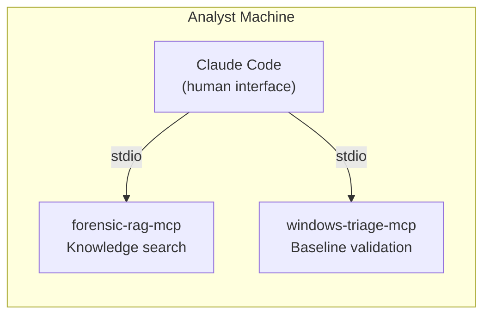
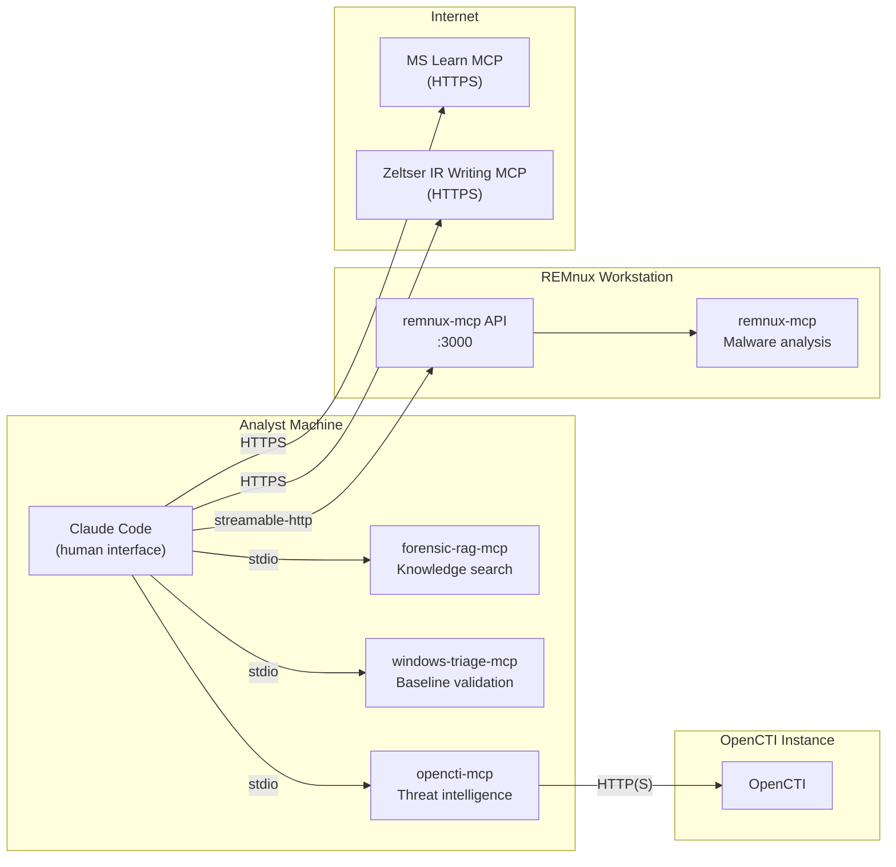
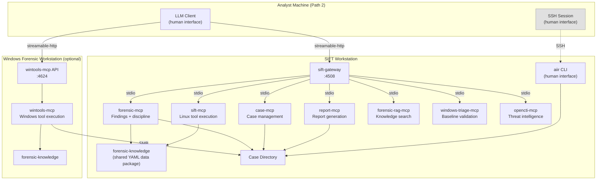
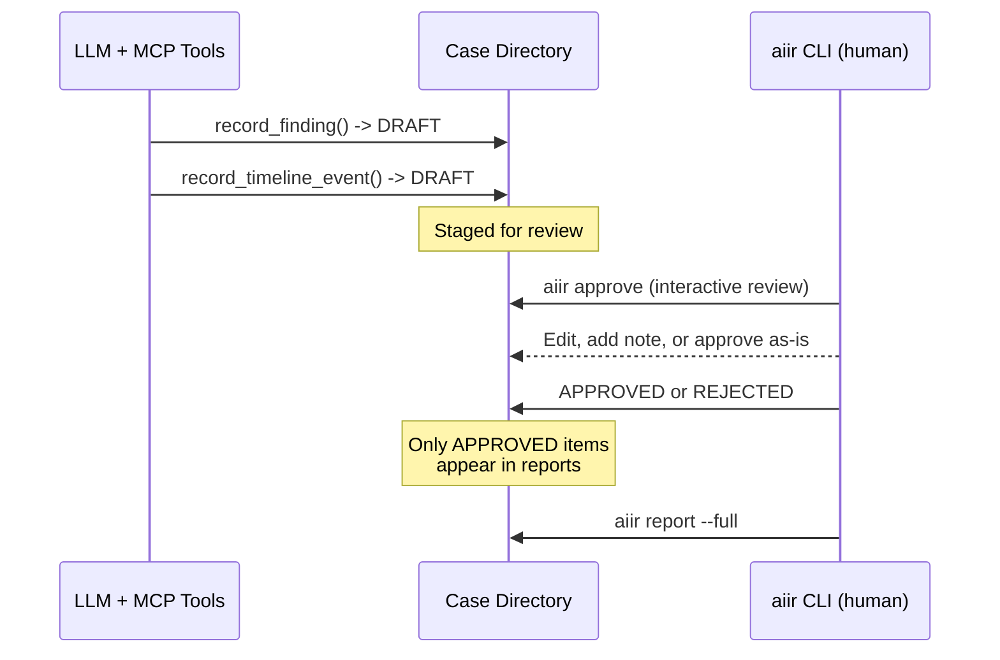
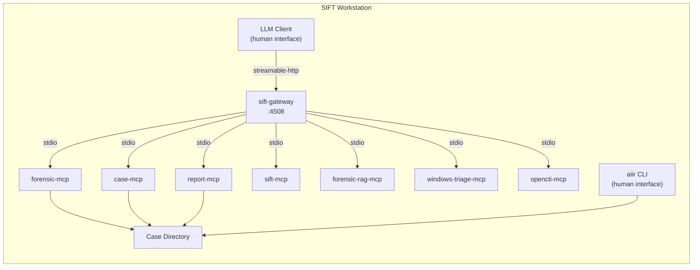
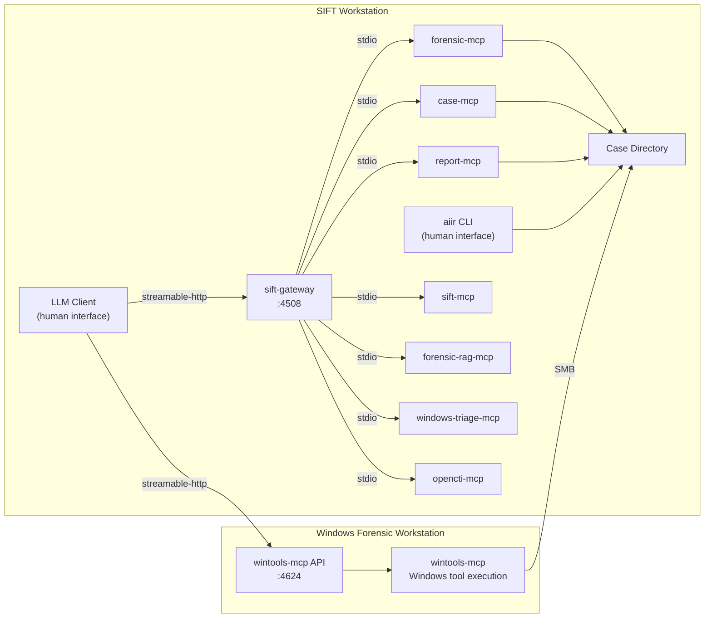
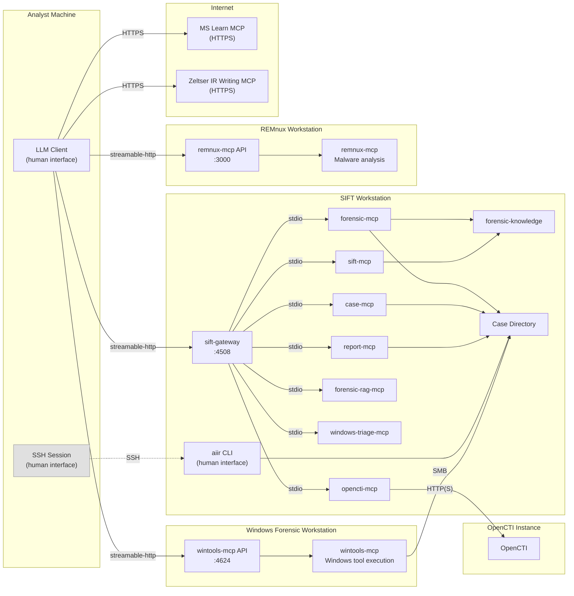
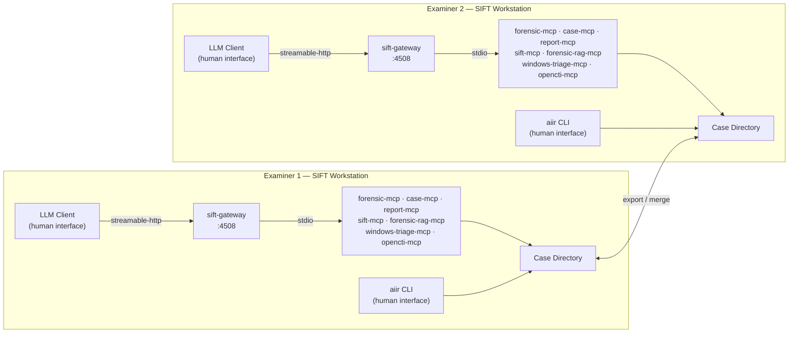

# AIIR
[](https://github.com/AppliedIR/aiir/actions/workflows/ci.yml)
[](https://appliedir.github.io/aiir/)
[](https://github.com/AppliedIR/aiir/blob/main/LICENSE)

AI Incident Response platform with varying levels of human-in-the-loop review and control based on your deployment needs. CLI and architecture reference.

**[Platform Documentation](https://appliedir.github.io/aiir/)** ·
[CLI Reference](https://appliedir.github.io/aiir/cli-reference/)

## AIIR Lite — Get Started in Minutes

In its simplest form, AIIR Lite provides Claude Code with forensic knowledge and instructions on how to enforce forensic rigor, present findings for human review, and audit actions taken. MCP servers enhance accuracy by providing authoritative information — a forensic knowledge RAG and a Windows triage database — plus optional OpenCTI threat intelligence and REMnux malware analysis.

```bash
git clone https://github.com/AppliedIR/sift-mcp.git && cd sift-mcp
./quickstart-lite.sh
claude
/welcome
```

#### AIIR Lite



#### AIIR Lite with Optional Add-ons



| Connection | Protocol | Notes |
|-----------|----------|-------|
| Claude Code → forensic-rag-mcp | stdio | Local Python process, always present |
| Claude Code → windows-triage-mcp | stdio | Local Python process, always present |
| Claude Code → opencti-mcp | stdio | Local Python process, connects out to OpenCTI via HTTP(S) |
| opencti-mcp → OpenCTI Instance | HTTP(S) | opencti-mcp runs locally, calls out to the OpenCTI server |
| Claude Code → remnux-mcp | streamable-http | Remote, on its own REMnux workstation |
| Claude Code → MS Learn MCP | HTTPS | `https://learn.microsoft.com/api/mcp` — streamable-http type in .mcp.json |
| Claude Code → Zeltser IR Writing MCP | HTTPS | `https://website-mcp.zeltser.com/mcp` — streamable-http type in .mcp.json |

No gateway, no sandbox, no deny rules. Claude runs forensic tools directly via Bash. Forensic discipline is suggested and reinforced via prompt hooks and reference documents, but Claude Code can choose to ignore them. See the [sift-mcp README](https://github.com/AppliedIR/sift-mcp#aiir-lite--get-started-in-minutes) for details and optional add-ons.

## Full AIIR — Structural Enforcement

For use cases where more definitive human-in-the-loop approval is desired, the full AIIR suite ensures accountability and enforces human review of findings through cryptographic signing, PIN-gated approvals, and multiple layered controls.

Full AIIR is **LLM client agnostic** — connect any MCP-compatible client through the gateway. Supported clients include Claude Code, Claude Desktop, Cursor, LibreChat, ChatGPT, and any client that can speak to a local MCP. Forensic discipline is provided structurally at the gateway and MCP layer, not through client-specific prompt engineering, so the same rigor applies regardless of which AI model or client drives the investigation.

## Platform Architecture

The LLM client and the aiir CLI are the two human-facing tools. The aiir CLI always runs on the SIFT workstation — it requires direct filesystem access to the case directory. When the LLM client runs on a separate machine (Path 2), the examiner must have SSH access to SIFT for all CLI operations (approve, review, report, etc.).

### Core Component Map



In Path 1 (co-located), the LLM client also runs on SIFT and no SSH is needed. In Path 2, the examiner SSHs into SIFT for all CLI operations.

### Human-in-the-Loop Workflow

All findings and timeline events are staged as DRAFT by the AI. Only a human examiner can approve or reject them via the `aiir` CLI. Approvals require a PIN to prevent AI from overriding human review.



### Where Things Run

| Component | Runs on | Port | Purpose |
|-----------|---------|------|---------|
| sift-gateway | SIFT | 4508 | Aggregates SIFT-local MCPs behind one HTTP endpoint |
| forensic-mcp | SIFT | (via gateway) | Findings, timeline, evidence, TODOs, discipline (12 tools + 14 resources) |
| case-mcp | SIFT | (via gateway) | Case management, audit queries, evidence registration (13 tools) |
| report-mcp | SIFT | (via gateway) | Report generation with profiles, IOC aggregation, MITRE mapping (6 tools) |
| sift-mcp | SIFT | (via gateway) | Denylist-protected forensic tool execution on Linux/SIFT (6 tools) |
| forensic-rag-mcp | SIFT | (via gateway) | Semantic search across Sigma, MITRE ATT&CK, Atomic Red Team, and more |
| windows-triage-mcp | SIFT | (via gateway) | Offline Windows baseline validation |
| opencti-mcp | SIFT | (via gateway) | Threat intelligence from OpenCTI (10 tools) |
| wintools-mcp | Windows | 4624 | Catalog-gated forensic tool execution on Windows (7 tools) |
| aiir CLI | SIFT | -- | Human-only: approve/reject findings, review cases, manage evidence. Remote examiners access via SSH. |
| forensic-knowledge | anywhere | -- | Shared YAML data package (tools, artifacts, discipline) |

The gateway exposes each backend as a separate MCP endpoint. Clients can connect to the aggregate endpoint or to individual backends:

```
http://localhost:4508/mcp              # Aggregate (all tools)
http://localhost:4508/mcp/forensic-mcp
http://localhost:4508/mcp/case-mcp
http://localhost:4508/mcp/report-mcp
http://localhost:4508/mcp/sift-mcp
http://localhost:4508/mcp/windows-triage-mcp
http://localhost:4508/mcp/forensic-rag-mcp
http://localhost:4508/mcp/opencti-mcp
```

### Deployment Topologies

Two primary deployment paths:

- **Path 1 — Co-located.** LLM client runs directly on the SIFT workstation. No TLS or token auth needed. All forensic controls apply (sandbox, audit hooks, PIN gate). Simplest setup — single machine, one installer.
- **Path 2 — Remote orchestrator.** LLM client runs on a separate machine (laptop, desktop). Connects to the gateway over the network with TLS and bearer token authentication. The examiner must have SSH access to SIFT for CLI operations (approve, reject, evidence unlock, execute). Run `setup-sift.sh --remote` to generate TLS certificates and bind the gateway to all interfaces. MCP-only clients (Claude Desktop, LibreChat) are well suited for this path — they can only reach SIFT through audited MCP tools.

#### Solo Analyst on SIFT (Path 1)



#### SIFT + Windows Forensic Workstation



#### Remote Orchestrator with Optional External MCPs (Path 2)



#### Multi-Examiner Team



### Case Directory Structure

```
cases/INC-2026-0219/
├── CASE.yaml                    # Case metadata (name, status, examiner)
├── evidence/                    # Original evidence (read-only after registration)
├── extractions/                 # Extracted artifacts
├── reports/                     # Generated reports
├── findings.json                # F-alice-001, F-alice-002, ...
├── timeline.json                # T-alice-001, ...
├── todos.json                   # TODO-alice-001, ...
├── evidence.json                # Evidence registry
├── actions.jsonl                # Investigative actions (append-only)
├── evidence_access.jsonl        # Chain-of-custody log
├── approvals.jsonl              # Approval audit trail
└── audit/
    ├── forensic-mcp.jsonl
    ├── sift-mcp.jsonl
    ├── claude-code.jsonl       # PostToolUse hook captures (Claude Code only)
    └── ...
```

### External Dependencies

- **Zeltser IR Writing MCP** — Required for report generation. Configured automatically by `aiir setup client`. URL: https://website-mcp.zeltser.com/mcp (HTTPS, no auth)

## Quick Start

### SIFT Workstation

Requires Python 3.11+ and sudo access.

```bash
# One-command quickstart (SIFT workstation)
curl -fsSL https://raw.githubusercontent.com/AppliedIR/sift-mcp/main/quickstart.sh -o /tmp/aiir-quickstart.sh && bash /tmp/aiir-quickstart.sh
```

Or step by step:

```bash
git clone https://github.com/AppliedIR/sift-mcp.git && cd sift-mcp
./setup-sift.sh
```

The installer handles everything: MCP servers, gateway, aiir CLI, HMAC verification ledger (`/var/lib/aiir/verification/`, requires sudo), examiner identity, and LLM client configuration. When you select Claude Code, additional forensic controls are deployed (kernel-level sandbox, case data deny rules, PreToolUse guard hook, PostToolUse audit hook, provenance enforcement, PIN-gated human approval with HMAC signing). Non-shell clients (Claude Desktop, Cursor, etc.) get MCP config only.

For tier selection (quick, recommended, custom) or remote access, run `setup-sift.sh` directly.

### Windows Forensic Workstation (optional)

```powershell
# Option 1: git clone
git clone https://github.com/AppliedIR/wintools-mcp.git; cd wintools-mcp

# Option 2: download ZIP (no git required)
Invoke-WebRequest https://github.com/AppliedIR/wintools-mcp/archive/refs/heads/main.zip -OutFile wintools.zip
Expand-Archive wintools.zip -DestinationPath .; cd wintools-mcp-main
```

Then run the installer:

```powershell
.\scripts\setup-windows.ps1
```

## Security Considerations

All AIIR components are assumed to run on a private forensic network, protected by firewalls, and not exposed to incoming connections from the Internet or potentially hostile systems. The design assumes dedicated, isolated systems are used throughout.

Any data loaded into the system or its component VMs, computers, or instances runs the risk of being exposed to the underlying AI. Only place data on these systems that you are willing to send to your AI provider.

Outgoing Internet connections are required for report generation (Zeltser IR Writing MCP) and optionally used for threat intelligence (OpenCTI) and documentation (MS Learn MCP). No incoming connections from external systems should be allowed.

AIIR is designed so that AI interactions flow through MCP tools, enabling security controls and audit trails. Clients with direct shell access (like Claude Code) can also operate outside MCP, but `aiir setup client` deploys forensic controls for Claude Code: a kernel-level sandbox restricts Bash writes, deny rules block Edit/Write to case data files, a PreToolUse hook guards against Bash redirections to protected files, a PostToolUse hook captures every Bash command to the audit trail, provenance enforcement ensures findings are traceable to evidence, and an HMAC verification ledger provides cryptographic proof that approved findings haven't been tampered with. AIIR is not designed to defend against a malicious AI or to constrain the AI client that you deploy.

## Commands

Most `aiir` CLI operations have MCP equivalents via case-mcp, forensic-mcp, and report-mcp. When working with an MCP-connected client, you can ask the AI to handle case management, evidence registration, report generation, and more — the AI operates through audited MCP tools rather than direct CLI invocation.

The commands below that require human interaction at the terminal (`/dev/tty`) **cannot** be delegated to the AI. These are intentional human-in-the-loop checkpoints — they use PIN entry, interactive review, or terminal confirmation to ensure the human examiner retains control over approval, rejection, and security-sensitive operations.

### Human-Only Commands (require terminal)

These commands read from `/dev/tty` directly and cannot be run by an AI client, even via Bash. This is by design — they are the human-in-the-loop controls that ensure the examiner reviews and approves all findings.

#### approve

```bash
aiir approve                                             # Interactive review of all DRAFT items
aiir approve F-alice-001 F-alice-002 T-alice-001         # Approve specific IDs
aiir approve F-alice-001 --edit                          # Edit in $EDITOR before approving
aiir approve F-alice-001 --note "Malware family unconfirmed"  # Approve with examiner note
aiir approve --by jane                                   # Filter to IDs with jane's examiner prefix
aiir approve --findings-only                             # Skip timeline events
aiir approve --timeline-only                             # Skip findings
```

Requires PIN entry via `/dev/tty`. Approved findings are HMAC-signed with a PBKDF2-derived key.

#### reject

```bash
aiir reject F-alice-003 --reason "Insufficient evidence for attribution"
aiir reject F-alice-003 T-alice-002 --reason "Contradicted by memory analysis"
```

Requires PIN confirmation via `/dev/tty`.

#### exec

```bash
aiir exec --purpose "Extract MFT from image" -- fls -r -m / image.E01
```

Requires `/dev/tty` confirmation. Logged to `audit/cli-exec.jsonl`. Use this for manual tool execution with audit trail when not operating through MCP.

#### evidence unlock

```bash
aiir unlock-evidence                       # Directory chmod 755, files remain 444
aiir evidence unlock
```

Requires `/dev/tty` confirmation. Unlocking evidence allows writes to the evidence directory.

#### PIN management

```bash
aiir config --setup-pin                    # Set approval PIN (PBKDF2-hashed)
aiir config --reset-pin                    # Reset PIN (requires current)
```

PIN entry uses masked input via `/dev/tty` with termios. No echo, no stdin — the AI cannot read or supply the PIN.

#### HMAC verification

```bash
aiir review --findings --verify            # Cross-check content hashes + HMAC verification
aiir review --findings --verify --mine    # HMAC verification for current examiner only
```

Verification requires the examiner's PIN to derive the HMAC key and confirm integrity.

### All Commands

The remaining commands can also be performed through MCP tools (case-mcp, forensic-mcp, report-mcp) when working with an MCP-connected client. The CLI equivalents are listed here for reference and for use outside MCP sessions.

#### case

```
aiir case init "Ransomware Investigation"                # Create a new case
aiir case close INC-2026-02191200                        # Close a case by ID
aiir case activate INC-2026-02191200                     # Set active case
aiir case migrate                                        # Migrate to flat layout (see below)
```

#### review

```bash
aiir review                                # Case summary (counts by status)
aiir review --findings                     # Findings table
aiir review --findings --detail            # Full finding detail
aiir review --iocs                         # IOCs grouped by approval status
aiir review --timeline                     # Timeline events
aiir review --timeline --status APPROVED   # Filter timeline by status
aiir review --timeline --start 2026-01-01 --end 2026-01-31   # Filter by date range
aiir review --timeline --type execution    # Filter by event type
aiir review --evidence                     # Evidence registry and access log
aiir review --audit --limit 100            # Audit trail (last N entries)
aiir review --todos --open                 # Open TODOs
```

#### todo

```bash
aiir todo                                                          # List open TODOs
aiir todo --all                                                    # Include completed
aiir todo add "Run volatility on server-04" --assignee jane --priority high --finding F-alice-003
aiir todo complete TODO-alice-001
aiir todo update TODO-alice-002 --note "Waiting on third party" --priority low
```

#### evidence

```bash
aiir register-evidence /path/to/image.E01 --description "Disk image from workstation"
aiir lock-evidence                         # All files chmod 444, directory chmod 555

aiir evidence register /path/to/image.E01 --description "Disk image"
aiir evidence list
aiir evidence verify
aiir evidence log [--path <filter>]
aiir evidence lock
```

#### export / merge

```bash
aiir export --file steve-findings.json      # Export findings for sharing
aiir merge --file jane-findings.json        # Merge another examiner's findings
```

#### report

```bash
aiir report --full [--save <path>]
aiir report --executive-summary [--save <path>]
aiir report --timeline [--from <date> --to <date>] [--save <path>]
aiir report --ioc [--save <path>]
aiir report --findings F-alice-001,F-alice-002 [--save <path>]
aiir report --status-brief [--save <path>]
```

#### audit

```bash
aiir audit log [--limit 100] [--mcp sift-mcp] [--tool run_command]
aiir audit summary
```

#### service

```bash
aiir service status                    # Show running backends + health
aiir service start forensic-rag        # Start a backend
aiir service stop windows-triage       # Stop a backend
aiir service restart sift-mcp          # Restart a backend
```

#### case migrate

```bash
aiir case migrate                                      # Migrate primary examiner data to flat layout
aiir case migrate --examiner alice                     # Specify examiner
aiir case migrate --import-all                         # Merge all examiners' data
```

#### config

```bash
aiir config --examiner "jane.doe"          # Set examiner identity
aiir config --show                         # Show current configuration
```

#### join

```bash
aiir join --sift SIFT_URL --code CODE                            # Join from remote machine using join code
aiir join --sift SIFT_URL --code CODE --wintools                 # Join as wintools machine (registers backend)
```

Exchange a one-time join code for gateway credentials. Run on the remote machine (analyst laptop or Windows forensic workstation). The join code is generated on SIFT via `aiir setup join-code`. Credentials are saved to `~/.aiir/config.yaml` with restricted permissions (0600).

#### setup

```
aiir setup                                 # Interactive (detect MCPs, configure, generate)
aiir setup --non-interactive               # Detect + generate configs
aiir setup test                            # Test MCP server connectivity
```

#### setup client

Generate Streamable HTTP config for your LLM client:

```bash
aiir setup client                                                          # Interactive wizard
aiir setup client --client=claude-code --sift=http://127.0.0.1:4508 -y    # Local solo
aiir setup client --sift=SIFT_IP:4508 --windows=WIN_IP:4624               # SIFT + Windows
```

For remote orchestrator setups (Path 2), remote examiners run a platform-specific setup script that creates a `~/aiir/` workspace with MCP config, forensic controls, and discipline docs:

```bash
# Linux
curl -sSL https://raw.githubusercontent.com/AppliedIR/aiir/main/setup-client-linux.sh \
  | bash -s -- --sift=https://SIFT_IP:4508 --code=XXXX-XXXX

# macOS
curl -sSL https://raw.githubusercontent.com/AppliedIR/aiir/main/setup-client-macos.sh \
  | bash -s -- --sift=https://SIFT_IP:4508 --code=XXXX-XXXX
```

```powershell
# Windows
Invoke-WebRequest -Uri https://raw.githubusercontent.com/AppliedIR/aiir/main/setup-client-windows.ps1 -OutFile setup-client-windows.ps1
.\setup-client-windows.ps1 -Sift https://SIFT_IP:4508 -Code XXXX-XXXX
```

Always launch your LLM client from `~/aiir/` or a subdirectory. Forensic controls only apply when started from within the workspace. To uninstall, re-run the setup script with `--uninstall` (Linux/macOS) or `-Uninstall` (Windows).

Claude Desktop requires the [mcp-remote](https://www.npmjs.com/package/mcp-remote) bridge for Streamable HTTP support.

| Client | Config file | Extras |
|--------|-------------|--------|
| Claude Code | `~/aiir/.mcp.json` (non-SIFT) or `~/.claude.json` (SIFT) | `CLAUDE.md`, `settings.json` (deny rules + PreToolUse guard + PostToolUse audit + sandbox), `forensic-audit.sh`, `pre-bash-guard.sh`, `FORENSIC_DISCIPLINE.md`, `TOOL_REFERENCE.md` |
| Claude Desktop | `~/.config/claude/claude_desktop_config.json` | Requires mcp-remote for Streamable HTTP |
| Cursor | `.cursor/mcp.json` | Copies `AGENTS.md` as `.cursorrules` |
| Cherry Studio | `cherry-studio-mcp.json` | Manual import into Cherry Studio settings |
| LibreChat | `librechat_mcp.yaml` | Merge into `librechat.yaml` |
| Other | `aiir-mcp-config.json` | Manual integration |

## Examiner Identity

Every approval, rejection, and command execution is logged with examiner identity. Resolution order:

| Priority | Source | Example |
|----------|--------|---------|
| 1 | `--examiner` flag | `aiir approve --examiner jane.doe F-jane-001` |
| 2 | `AIIR_EXAMINER` env var | `export AIIR_EXAMINER=jane.doe` |
| 3 | `~/.aiir/config.yaml` | `examiner: jane.doe` |
| 4 | `AIIR_ANALYST` env var | Deprecated fallback |
| 5 | OS username | Warns if unconfigured |

## Repo Map

| Repo | Purpose |
|------|---------|
| [sift-mcp](https://github.com/AppliedIR/sift-mcp) | Monorepo: 10 SIFT packages (forensic-mcp, case-mcp, report-mcp, sift-mcp, sift-gateway, forensic-knowledge, forensic-rag, windows-triage, opencti, sift-common) |
| [wintools-mcp](https://github.com/AppliedIR/wintools-mcp) | Windows forensic tool execution (7 tools, 22 catalog entries) |
| [aiir](https://github.com/AppliedIR/aiir) | CLI, architecture reference |

## Upgrading from Lite to Full

Both modes share the same knowledge base, MCPs, and audit format. Upgrading adds the gateway, sandbox, enforcement layer, and structured case management. Note: lite case data (markdown files) does not auto-migrate to full case data (structured JSON). Start fresh or transfer findings manually.

## Evidence Handling

Never place original evidence on any AIIR system. Only use working copies for which verified originals or backups exist. AIIR workstations process evidence through AI-connected tools, and any data loaded into these systems may be transmitted to the configured AI provider. Treat all AIIR systems as analysis environments, not evidence storage.

Evidence integrity is verified by SHA-256 hashes recorded at registration. Examiners can optionally lock evidence to read-only via `aiir evidence lock`. Proper evidence integrity depends on verified hashes, write blockers, and chain-of-custody procedures that exist outside this platform.

Case directories can reside on external or removable media. ext4 is preferred for full permission support. NTFS and exFAT are acceptable but file permission controls (read-only protection) will be silently ineffective. FAT32 is discouraged due to the 4 GB file size limit.

## Responsible Use

This project demonstrates the capabilities of AI-assisted incident response. While steps have been taken to enforce human-in-the-loop controls, it is ultimately the responsibility of each examiner to ensure that their findings are accurate and complete. Ultimate responsibility rests with the human. The AI, like a hex editor, is a tool to be used by properly trained incident response professionals. Users are responsible for ensuring their use complies with applicable laws, regulations, and organizational policies.

## Acknowledgments

Architecture and direction by Steve Anson. Implementation by Claude Code (Anthropic).

## Clear Disclosure

I do DFIR. I am not a developer. This project would not exist without Claude Code handling the implementation. While an immense amount of effort has gone into design, testing, and review, I fully acknowledge that I may have been working hard and not smart in places. My intent is to jumpstart discussion around ways this technology can be leveraged for efficiency in incident response while ensuring that the ultimate responsibility for accuracy remains with the human examiner.

## License

MIT License - see [LICENSE](LICENSE)
