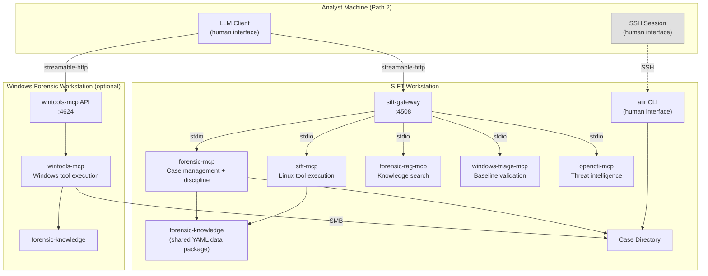
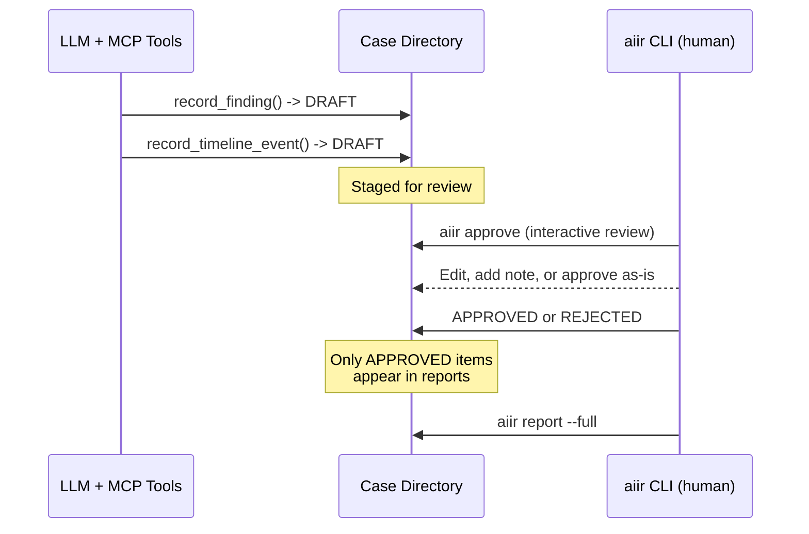
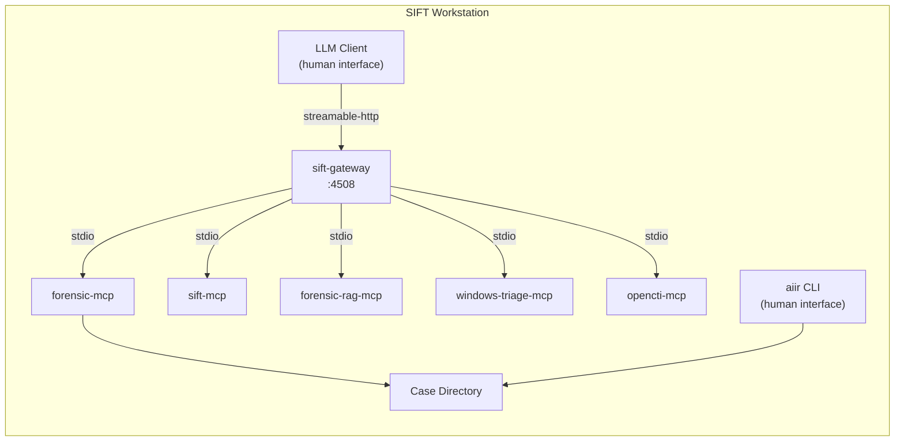
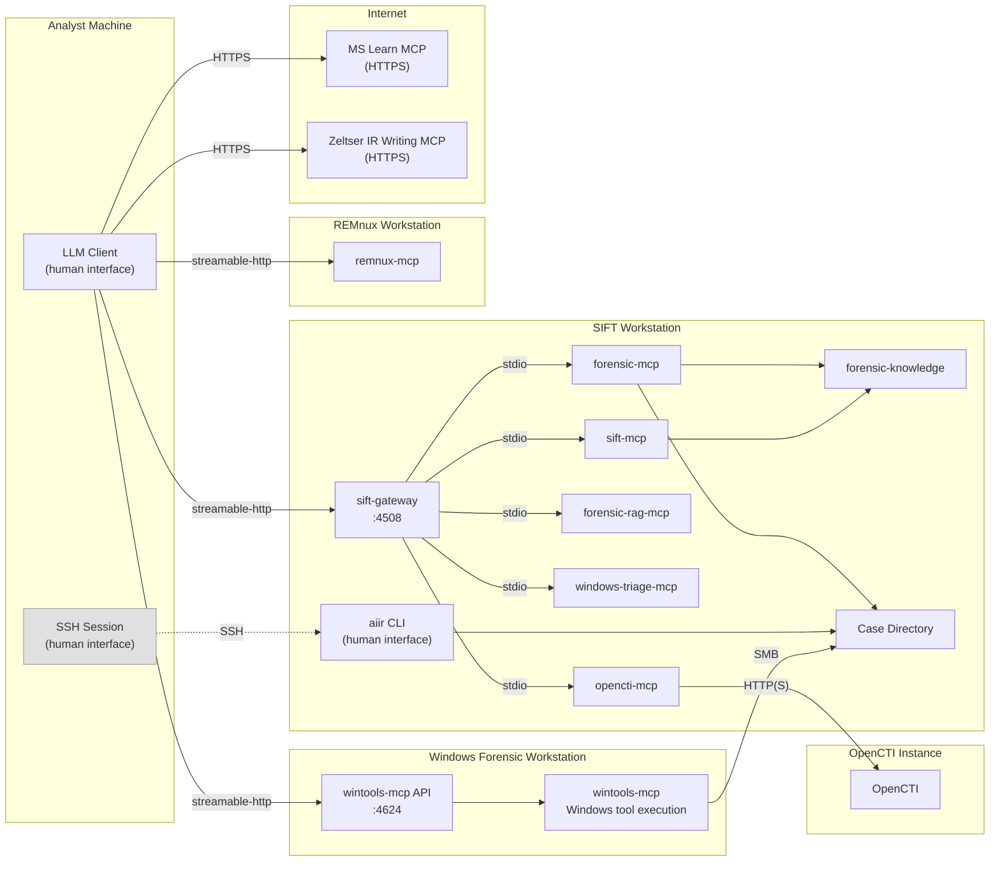
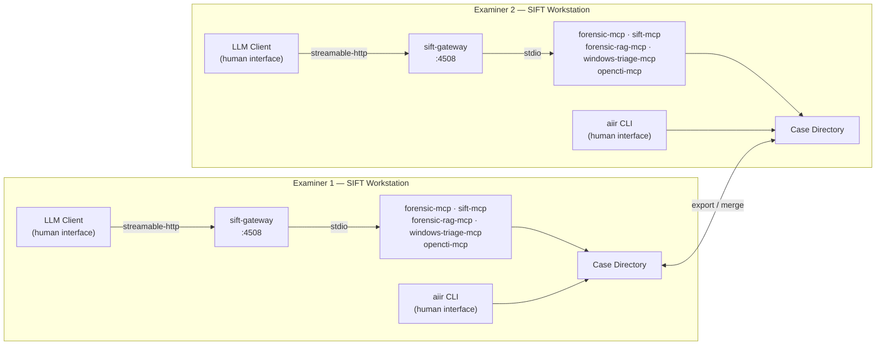

# AIIR

Artificial Intelligence Incident Response platform. CLI and architecture reference.

## Platform Architecture

AIIR is an LLM-agnostic forensic investigation platform built on the Model Context Protocol (MCP). Any MCP-compatible orchestrator works: Claude Code, Cursor, Claude Desktop, Cherry Studio, LibreChat, Goose, and others. The LLM client and the aiir CLI are the two human-facing tools. The aiir CLI always runs on the SIFT workstation — it requires direct filesystem access to the case directory. When the LLM client runs on a separate machine (Path 2), the examiner must have SSH access to SIFT for all CLI operations (approve, review, report, etc.).

### Core Component Map



In Path 1 (co-located), the LLM client also runs on SIFT and no SSH is needed. In Path 2, the examiner SSHs into SIFT for all CLI operations.

### Human-in-the-Loop Workflow

All findings and timeline events are staged as DRAFT by the AI. Only a human examiner can approve or reject them via the `aiir` CLI. Approvals require a PIN to prevent AI from overriding human review.



### Where Things Run

| Component | Runs on | Port | Purpose |
|-----------|---------|------|---------|
| sift-gateway | SIFT | 4508 | Aggregates SIFT-local MCPs behind one HTTP endpoint |
| forensic-mcp | SIFT | (via gateway) | Case management, findings, timeline, evidence, discipline (15 tools + 14 resources) |
| sift-mcp | SIFT | (via gateway) | Authenticated, denylist-protected forensic tool execution on Linux/SIFT |
| forensic-rag-mcp | SIFT | (via gateway) | Semantic search across Sigma, MITRE ATT&CK, Atomic Red Team, and more |
| windows-triage-mcp | SIFT | (via gateway) | Offline Windows baseline validation |
| opencti-mcp | SIFT | (via gateway) | Threat intelligence from OpenCTI |
| wintools-mcp | Windows | 4624 | Catalog-gated forensic tool execution on Windows |
| aiir CLI | SIFT | -- | Human-only: approve/reject findings, review cases, manage evidence. Remote examiners access via SSH. |
| forensic-knowledge | anywhere | -- | Shared YAML data package (tools, artifacts, discipline) |

The gateway exposes each backend as a separate MCP endpoint. Clients can connect to the aggregate endpoint or to individual backends:

```
http://localhost:4508/mcp              # Aggregate (all tools)
http://localhost:4508/mcp/forensic-mcp
http://localhost:4508/mcp/sift-mcp
http://localhost:4508/mcp/windows-triage-mcp
http://localhost:4508/mcp/forensic-rag-mcp
http://localhost:4508/mcp/opencti-mcp
```

### Deployment Topologies

Two primary deployment paths:

- **Path 1 — Co-located (testing / quickstart).** LLM client runs directly on the SIFT workstation. No TLS or token auth needed. Good for training, single-analyst work, and getting started.
- **Path 2 — Remote orchestrator (preferred for production).** LLM client runs on a separate machine (laptop, desktop). Connects to the gateway over the network with TLS and bearer token authentication. The examiner must have SSH access to SIFT for all CLI operations (approve, review, report, evidence, etc.). Run `sift-install.sh --remote` to generate TLS certificates and bind the gateway to all interfaces.

#### Solo Analyst on SIFT (Path 1)



#### SIFT + Windows Forensic Workstation


#### Remote Orchestrator with Optional External MCPs (Path 2)



#### Multi-Examiner Team



### Case Directory Structure

```
cases/INC-2026-0219/
├── CASE.yaml                    # Case metadata (name, status, examiner)
├── evidence/                    # Original evidence (read-only after registration)
├── extractions/                 # Extracted artifacts
├── reports/                     # Generated reports
├── findings.json                # F-alice-001, F-alice-002, ...
├── timeline.json                # T-alice-001, ...
├── todos.json                   # TODO-alice-001, ...
├── evidence.json                # Evidence registry
├── actions.jsonl                # Investigative actions (append-only)
├── evidence_access.jsonl        # Chain-of-custody log
├── approvals.jsonl              # Approval audit trail
└── audit/
    ├── forensic-mcp.jsonl
    ├── sift-mcp.jsonl
    └── ...
```

## Quick Start

### SIFT Workstation

```bash
# One-command quickstart (SIFT workstation)
curl -sSL https://raw.githubusercontent.com/AppliedIR/sift-mcp/main/quickstart.sh | bash
```

Or step by step:

```bash
git clone https://github.com/AppliedIR/sift-mcp.git && cd sift-mcp
./sift-install.sh          # Install MCP servers + gateway
cd .. && git clone https://github.com/AppliedIR/aiir.git && cd aiir
./aiir-install.sh          # Install aiir CLI + configure client
```

We recommend using an LLM client that does not have the ability to directly interface with your system's shell. Tools like Claude Code are amazingly effective, but difficult to constrain. Our system is designed to require the LLM to go through existing MCPs to ensure proper audit trail when accessing forensic tooling. However, your use case may be different. If you prefer to move fast, break things, and let Claude take the wheel:

```bash
curl -sSL https://raw.githubusercontent.com/AppliedIR/sift-mcp/main/quickstart.sh | bash -s -- --ccode
```

The quickstart installs all core components, starts the gateway, and runs the aiir setup wizard. For tier selection (quick, recommended, custom) or remote access, run `sift-install.sh` directly.

### Windows Forensic Workstation (optional)

```powershell
# Option 1: git clone
git clone https://github.com/AppliedIR/wintools-mcp.git; cd wintools-mcp

# Option 2: download ZIP (no git required)
Invoke-WebRequest https://github.com/AppliedIR/wintools-mcp/archive/refs/heads/main.zip -OutFile wintools.zip
Expand-Archive wintools.zip -DestinationPath .; cd wintools-mcp-main
```

Then run the installer:

```powershell
.\scripts\setup-windows.ps1
```

## Security Considerations

All AIIR components are assumed to run on a private forensic network, protected by firewalls, and not exposed to incoming connections from the Internet or potentially hostile systems. The design assumes dedicated, isolated systems are used throughout.

Any data loaded into the system or its component VMs, computers, or instances runs the risk of being exposed to the underlying AI. Only place data on these systems that you are willing to send to your AI provider.

While outgoing connections to the Internet are used for some optional components (OpenCTI, MS Learn MCP, Zeltser IR Writing MCP), no incoming connections from external systems should be allowed.

When choosing an LLM client, we recommend constrained clients that are limited to chat and MCP functionality. AIIR is designed so that AI interactions flow through MCP tools, enabling security controls and audit trails. AI clients with the ability to run arbitrary commands on the host system can bypass those safeguards. Such clients can still interact with AIIR, but they can also conduct activities outside the scope of the platform's controls. AIIR is not designed to defend against a malicious AI or to constrain the AI client that you deploy.

## Commands

### case

```
aiir case init "Ransomware Investigation"                # Create a new case
aiir case close                                          # Close the active case
aiir case activate INC-2026-02191200                     # Set active case
aiir case migrate                                        # Migrate to flat layout (see below)
```

### approve

```bash
aiir approve                                             # Interactive review of all DRAFT items
aiir approve F-alice-001 F-alice-002 T-alice-001         # Approve specific IDs
aiir approve F-alice-001 --edit                          # Edit in $EDITOR before approving
aiir approve F-alice-001 --note "Malware family unconfirmed"  # Approve with examiner note
aiir approve --by jane                                   # Filter to IDs with jane's examiner prefix
aiir approve --findings-only                             # Skip timeline events
aiir approve --timeline-only                             # Skip findings
```

### reject

```bash
aiir reject F-alice-003 --reason "Insufficient evidence for attribution"
aiir reject F-alice-003 T-alice-002 --reason "Contradicted by memory analysis"
```

### review

```bash
aiir review                                # Case summary (counts by status)
aiir review --findings                     # Findings table
aiir review --findings --detail            # Full finding detail
aiir review --findings --verify            # Cross-check against approval records + content hash integrity
aiir review --iocs                         # IOCs grouped by approval status
aiir review --timeline                     # Timeline events
aiir review --timeline --status APPROVED   # Filter timeline by status
aiir review --timeline --start 2026-01-01 --end 2026-01-31   # Filter by date range
aiir review --timeline --type execution    # Filter by event type
aiir review --evidence                     # Evidence registry and access log
aiir review --audit --limit 100            # Audit trail (last N entries)
aiir review --todos --open                 # Open TODOs
```

### todo

```bash
aiir todo                                                          # List open TODOs
aiir todo --all                                                    # Include completed
aiir todo add "Run volatility on server-04" --assignee jane --priority high --finding F-alice-003
aiir todo complete TODO-alice-001
aiir todo update TODO-alice-002 --note "Waiting on third party" --priority low
```

### service

```bash
aiir service status                    # Show running backends + health
aiir service start forensic-rag        # Start a backend
aiir service stop windows-triage       # Stop a backend
aiir service restart sift-mcp          # Restart a backend
```

### exec

```bash
aiir exec --purpose "Extract MFT from image" -- fls -r -m / image.E01
```

Requires `/dev/tty` confirmation. Logged to `audit/cli-exec.jsonl`.

### evidence

```bash
aiir register-evidence /path/to/image.E01 --description "Disk image from workstation"
aiir lock-evidence                         # All files chmod 444, directory chmod 555
aiir unlock-evidence                       # Directory chmod 755, files remain 444

aiir evidence register /path/to/image.E01 --description "Disk image"
aiir evidence list
aiir evidence verify
aiir evidence log [--path <filter>]
aiir evidence lock
aiir evidence unlock
```

### sync

```bash
aiir sync export --file steve-findings.json      # Export findings for sharing
aiir sync import --file jane-findings.json        # Merge another examiner's findings
```

### report

```bash
aiir report --full [--save <path>]
aiir report --executive-summary [--save <path>]
aiir report --timeline [--from <date> --to <date>] [--save <path>]
aiir report --ioc [--save <path>]
aiir report --findings F-alice-001,F-alice-002 [--save <path>]
aiir report --status-brief [--save <path>]
```

### audit

```bash
aiir audit log [--limit 100] [--mcp sift-mcp] [--tool run_command]
aiir audit summary
```

### case migrate

```bash
aiir case migrate                                      # Migrate primary examiner data to flat layout
aiir case migrate --examiner alice                     # Specify examiner
aiir case migrate --import-all                         # Merge all examiners' data
```

### config

```bash
aiir config --examiner "jane.doe"          # Set examiner identity
aiir config --show                         # Show current configuration
aiir config --setup-pin                    # Set approval PIN (PBKDF2-hashed)
aiir config --reset-pin                    # Reset PIN (requires current)
```

### join

```bash
aiir join SIFT_URL CODE                                          # Join from remote machine using join code
aiir join SIFT_URL CODE --wintools                               # Join as wintools machine (registers backend)
```

Exchange a one-time join code for gateway credentials. Run on the remote machine (analyst laptop or Windows forensic workstation). The join code is generated on SIFT via `aiir setup join-code`. Credentials are saved to `~/.aiir/config.yaml` with restricted permissions (0600).

### setup

```
aiir setup                                 # Interactive (detect MCPs, configure, generate)
aiir setup --non-interactive               # Detect + generate configs
aiir setup test                            # Test MCP server connectivity
```

### setup client

Generate Streamable HTTP config for your LLM client:

```bash
aiir setup client                                                          # Interactive wizard
aiir setup client --client=claude-code --sift=http://127.0.0.1:4508 -y    # Local solo
aiir setup client --sift=SIFT_IP:4508 --windows=WIN_IP:4624               # SIFT + Windows
aiir setup client --no-zeltser -y                                          # Exclude optional MCPs
```

For remote orchestrator setups (Path 2), use the `--remote` flag:

```bash
aiir setup client --remote                                                 # Interactive remote wizard
aiir setup client --remote --client=claude-code --token=TOKEN              # Claude Code on remote machine
aiir setup client --remote --client=claude-desktop --token=TOKEN           # Claude Desktop (uses mcp-remote bridge)
```

Remote mode prompts for the gateway URL, bearer token, and optional Windows VM address. Claude Desktop requires the [mcp-remote](https://www.npmjs.com/package/mcp-remote) bridge for Streamable HTTP support.

| Client | Config file | Extras |
|--------|-------------|--------|
| Claude Code | `.mcp.json` | Copies `AGENTS.md` as `CLAUDE.md` |
| Claude Desktop | `~/.config/claude/claude_desktop_config.json` | Requires mcp-remote for Streamable HTTP |
| Cursor | `.cursor/mcp.json` | Copies `AGENTS.md` as `.cursorrules` |
| Cherry Studio | `cherry-studio-mcp.json` | Manual import into Cherry Studio settings |
| LibreChat | `librechat_mcp.yaml` | Merge into `librechat.yaml` |
| Other | `aiir-mcp-config.json` | Manual integration |

## Examiner Identity

Every approval, rejection, and command execution is logged with examiner identity. Resolution order:

| Priority | Source | Example |
|----------|--------|---------|
| 1 | `--examiner` flag | `aiir approve --examiner jane.doe F-jane-001` |
| 2 | `AIIR_EXAMINER` env var | `export AIIR_EXAMINER=jane.doe` |
| 3 | `~/.aiir/config.yaml` | `examiner: jane.doe` |
| 4 | `AIIR_ANALYST` env var | Deprecated fallback |
| 5 | OS username | Warns if unconfigured |

## Repo Map

| Repo | Purpose |
|------|---------|
| [sift-mcp](https://github.com/AppliedIR/sift-mcp) | Monorepo: all SIFT components (forensic-mcp, sift-mcp, sift-gateway, forensic-knowledge, forensic-rag, windows-triage, opencti) |
| [wintools-mcp](https://github.com/AppliedIR/wintools-mcp) | Windows forensic tool execution (7 tools, 22 catalog entries) |
| [aiir](https://github.com/AppliedIR/aiir) | CLI, architecture reference |

## Evidence Handling

Never place original evidence on any AIIR system. Only use working copies for which verified originals or backups exist. AIIR workstations process evidence through AI-connected tools, and any data loaded into these systems may be transmitted to the configured AI provider. Treat all AIIR systems as analysis environments, not evidence storage.

AIIR sets registered evidence files to read-only (chmod 444) as a defense-in-depth measure to prevent accidental modification. This is not an evidence integrity feature. Proper evidence integrity depends on verified hashes, write blockers, and chain-of-custody procedures that exist outside this platform.

Case directories can reside on external or removable media. ext4 is preferred for full permission support. NTFS and exFAT are acceptable but file permission controls (read-only protection) will be silently ineffective. FAT32 is discouraged due to the 4 GB file size limit.

## Responsible Use

This project demonstrates the capabilities of AI-assisted incident response. While steps have been taken to enforce human-in-the-loop controls, it is ultimately the responsibility of each examiner to ensure that their findings are accurate and complete. Ultimate responsibility rests with the human. The AI, like a hex editor, is a tool to be used by properly trained incident response professionals. Users are responsible for ensuring their use complies with applicable laws, regulations, and organizational policies.

## Acknowledgments

Architecture and direction by Steve Anson. Implementation by Claude Code (Anthropic).

## License

MIT License - see [LICENSE](LICENSE)
