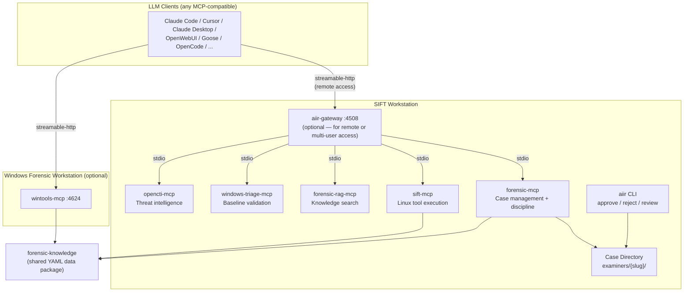
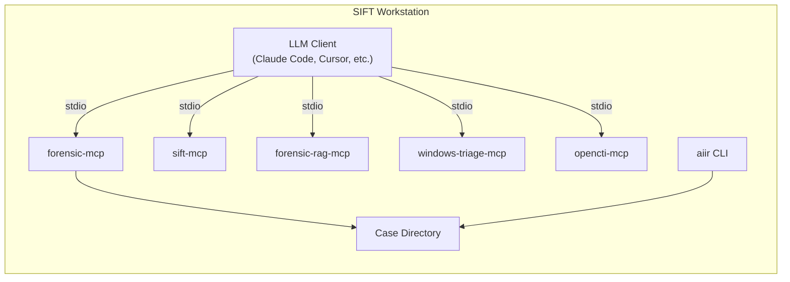
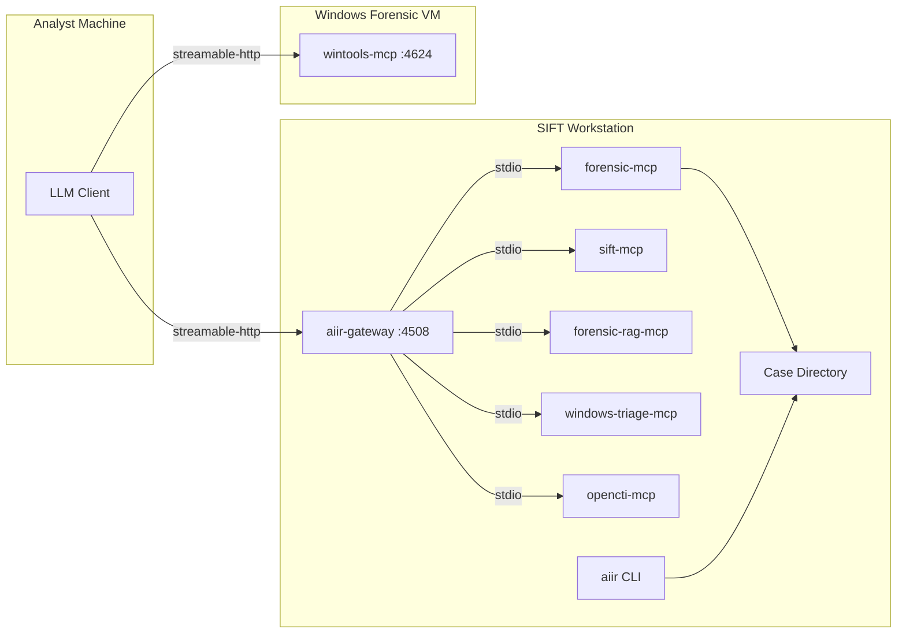
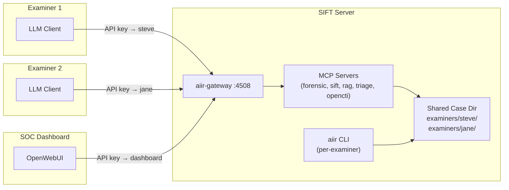
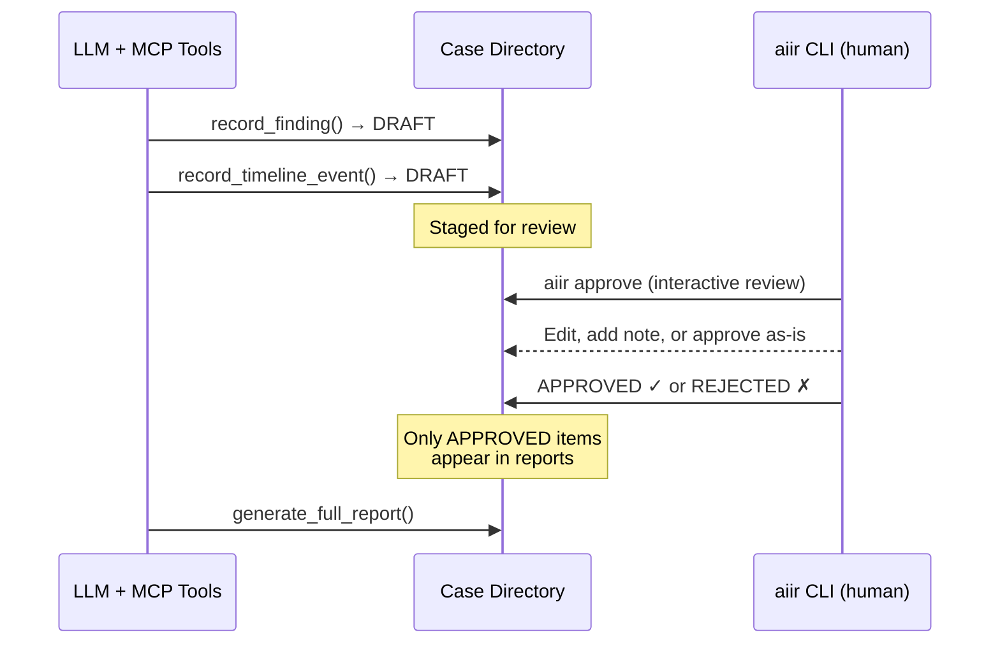

# AIIR CLI

Command-line interface for **human-in-the-loop forensic investigation management**. The `aiir` CLI provides the actions that only a human analyst should perform: approving findings, rejecting conclusions, managing evidence integrity, executing forensic commands with audit trails, and configuring the investigation platform.

## Installation Options

### Option A: As Part of AIIR (Recommended)

This CLI is designed as a component of the AIIR (Applied Incident Response) platform, working alongside [forensic-mcp](https://github.com/AppliedIR/forensic-mcp).

```bash
git clone https://github.com/AppliedIR/aiir.git
cd aiir
python3 -m venv .venv && source .venv/bin/activate
pip install -e ".[dev]"
```

### Option B: Standalone Installation

Use standalone when you need the approval workflow without the full AIIR platform.

See the **Quick Start** section below.

---

## Overview

The AI assistant (via forensic-mcp) stages findings and timeline events as DRAFT. The `aiir` CLI is how a human analyst reviews, approves, or rejects those items. This separation is structural — the AI cannot approve its own work.

> **Important:** The `aiir` CLI is a human-only tool. It is not designed to be called by the AI orchestrator. Every approval and rejection is logged with analyst identity, timestamp, and OS user for full accountability.

**Key Capabilities:**

- **Interactive Review** - Walk through each staged item with approve/edit/note/reject/todo/skip options
- **Finding Modification** - Edit AI-generated findings via `$EDITOR`, add examiner notes, override interpretations
- **Team Review** - Filter by creator analyst, review only findings or timeline events
- **Investigation TODOs** - Create and manage action items with assignee, priority, and finding links
- **Evidence Management** - Register evidence files (SHA256 + read-only), lock/unlock evidence directories
- **Forensic Execution** - Run commands with interactive confirmation, audit trail, and case context
- **Platform Setup** - Interactive `aiir setup` to detect MCPs and generate config for Claude Code, Cursor, Claude Desktop, and OpenWebUI
- **Analyst Identity** - Configurable identity resolution for audit accountability

## Platform Architecture

AIIR is a multi-component forensic investigation platform. The components can be deployed in several configurations depending on team size, workstation setup, and LLM client preference.

### Component Map



When the LLM client runs directly on SIFT, it can connect to MCPs via stdio (no gateway needed). When the client is on a different machine, the gateway aggregates SIFT MCPs behind a single HTTP endpoint. wintools-mcp is an independent server on Windows — not managed by the gateway.

### Deployment Topologies

AIIR supports several deployment configurations. Choose the one that fits your environment.

#### Solo Analyst on SIFT (stdio)

The simplest setup. One analyst, one SIFT workstation. The LLM client runs directly on SIFT and connects to MCP servers via stdio. No gateway needed.



Setup: `aiir setup` (auto-detects locally installed MCPs and generates stdio config).

#### SIFT + Windows Forensic VM

Two machines: a SIFT workstation running the gateway and a Windows VM running wintools-mcp. The analyst's LLM client connects to both via Streamable HTTP.



Setup on analyst machine: `aiir setup client --sift=SIFT_IP:4508 --windows=WIN_IP:4624`

#### Multi-Examiner Team

Multiple analysts share a case through the gateway. Each examiner has a unique API key that maps to their identity. All examiners work in isolated `examiners/{slug}/` directories with merged reads for team visibility.



Setup: `aiir case init "Investigation" --collaborative`, then each examiner runs `aiir setup client --sift=SERVER:4508`.

### Human-in-the-Loop Workflow

All findings and timeline events are staged as DRAFT by the AI. Only a human analyst can approve or reject them via the `aiir` CLI. This is a structural guarantee.



### Case Directory Structure

```
cases/INC-2026-0219/
├── CASE.yaml                    # Case metadata (name, mode, team)
├── evidence/                    # Original evidence (read-only after registration)
├── extracted/                   # Extracted artifacts
├── reports/                     # Generated reports
└── examiners/
    ├── steve/                   # Examiner "steve"
    │   ├── findings.json        # Findings (DRAFT → APPROVED/REJECTED)
    │   ├── timeline.json        # Timeline events
    │   ├── todos.json           # Investigation TODOs
    │   ├── evidence.json        # Evidence registry
    │   ├── approvals.jsonl      # Approval audit trail
    │   └── audit/
    │       ├── forensic-mcp.jsonl
    │       ├── sift-mcp.jsonl
    │       └── ...
    └── jane/                    # Examiner "jane" (same structure)
        └── ...
```

## Commands

### approve

Interactive review with per-item options:

```bash
# Interactive review — walk through each DRAFT item
aiir approve
#   [a]pprove  [e]dit & approve  [n]ote & approve
#   [r]eject   [t]odo            [s]kip  [q]uit

# Approve specific IDs
aiir approve F-001 F-002 T-001

# Approve with examiner note
aiir approve F-001 --note "Finding correct. Malware family unconfirmed."

# Approve with field override
aiir approve F-001 --interpretation "Process masquerading confirmed, no lateral movement"

# Approve with $EDITOR (opens finding as YAML for modification)
aiir approve F-001 --edit

# Team review: filter by creator analyst
aiir approve --by jane

# Review only findings (skip timeline events)
aiir approve --findings-only

# Review only timeline events
aiir approve --timeline-only
```

When approving with modifications, original AI content is preserved in `examiner_modifications` for audit trail.

### reject

```bash
# Reject with reason
aiir reject F-003 --reason "Insufficient evidence for attribution"
```

### review

```bash
# Case summary (default)
aiir review

# Findings grouped by status
aiir review --findings

# Full detail (with --findings or --timeline)
aiir review --findings --detail

# Cross-check findings against approval records
aiir review --verify

# Extract IOCs from findings grouped by status
aiir review --iocs

# Timeline events
aiir review --timeline

# Evidence registry and access log
aiir review --evidence

# Audit trail (last N entries)
aiir review --audit --limit 100

# Investigation TODOs
aiir review --todos
aiir review --todos --open
```

### todo

```bash
# List open TODOs
aiir todo

# List all TODOs including completed
aiir todo --all

# Filter by assignee
aiir todo --assignee jane

# Add a new TODO
aiir todo add "Run volatility on server-04 memory dump" --assignee jane --priority high --finding F-003

# Mark TODO as completed
aiir todo complete TODO-001

# Update a TODO
aiir todo update TODO-002 --note "Waiting on third party" --priority low
```

### exec

```bash
# Execute forensic command with audit trail
aiir exec --purpose "Extract MFT from image" -- fls -r -m / image.E01
```

### evidence

```bash
# Register evidence file (SHA256 hash + chmod 444)
aiir register-evidence /path/to/image.E01 --description "Disk image from workstation"

# Lock evidence directory (all files read-only, dir set to 555)
aiir lock-evidence

# Unlock evidence directory for new files (interactive confirmation)
aiir unlock-evidence
```

### setup

Interactive setup wizard to detect installed MCP servers and generate configuration files:

```bash
# Interactive setup
aiir setup

# Non-interactive (generates Claude Code config only)
aiir setup --non-interactive

# Force re-prompting for all values
aiir setup --force-reprompt
```

Setup phases:
1. **Detect** - Finds installed MCP servers (system Python and venvs)
2. **Credentials** - Configures OpenCTI URL/token, REMnux host (if applicable)
3. **Client Selection** - Choose Claude Code, Cursor, Claude Desktop, and/or OpenWebUI
4. **Generate** - Writes `.mcp.json`, `claude_desktop_config.json`, and/or `gateway.yaml`

```bash
# Test MCP server connectivity
aiir setup test
```

#### setup client

Generate LLM client configuration pointing at AIIR API servers. All entries use `streamable-http` — the client connects to gateways over HTTP, not stdio.

```bash
# Interactive wizard
aiir setup client

# Non-interactive with switches
aiir setup client \
    --client=claude-code \
    --sift=http://192.168.1.10:4508 \
    --windows=192.168.1.20:4624 \
    --examiner=steve \
    -y

# Exclude optional MCPs
aiir setup client --no-zeltser -y
```

Generates:
- **Claude Code**: `.mcp.json` + `CLAUDE.md` (from `AGENTS.md`)
- **Claude Desktop**: `~/.config/claude/claude_desktop_config.json`
- **Cursor**: `.cursor/mcp.json` + `.cursorrules` (from `AGENTS.md`)
- **Other**: `aiir-mcp-config.json` (manual integration)

### case

```bash
# Initialize a new case (solo mode)
aiir case init --name "Ransomware Investigation"

# Initialize a collaborative case
aiir case init --name "Team Investigation" --collaborative

# Join an existing case
aiir case join --case-id INC-2026-02191200
```

### sync

```bash
# Export your contributions as a JSON bundle
aiir sync export

# Import another examiner's contribution bundle
aiir sync import /path/to/bundle.json
```

### config

```bash
# Set examiner identity
aiir config --examiner "jane.doe"

# Show current configuration
aiir config --show

# Set approval PIN
aiir config --setup-pin

# Reset approval PIN
aiir config --reset-pin
```

## Examiner Identity

Every approval, rejection, and execution is logged with examiner identity. Resolution order:

| Priority | Source | Example |
|----------|--------|---------|
| 1 | `--examiner` flag | `aiir approve --examiner jane.doe F-001` |
| 2 | `AIIR_EXAMINER` env var | `export AIIR_EXAMINER=jane.doe` |
| 3 | `~/.aiir/config.yaml` | `examiner: jane.doe` |
| 4 | `AIIR_ANALYST` env var | Deprecated, falls back to `AIIR_EXAMINER` |
| 5 | OS username (fallback) | Warns if unconfigured |

The OS username is always captured alongside the explicit examiner identity for accountability.

## Configuration

| Variable | Default | Description |
|----------|---------|-------------|
| `AIIR_EXAMINER` | (none) | Examiner identity for audit trail |
| `AIIR_ANALYST` | (none) | Deprecated alias for `AIIR_EXAMINER` |
| `AIIR_CASE_DIR` | (none) | Active case directory |
| `AIIR_CASES_DIR` | `cases` | Root directory for case storage |

## Quick Start

```bash
git clone https://github.com/AppliedIR/aiir.git
cd aiir
python3 -m venv .venv && source .venv/bin/activate
pip install -e .

# Set your identity
aiir config --examiner "your.name"

# Review a case
aiir review --case INC-2026-0219120000
```

## Project Structure

```
aiir/
├── src/aiir_cli/
│   ├── __init__.py
│   ├── main.py                     # Entry point and argument parser
│   ├── identity.py                 # Analyst identity resolution
│   ├── case_io.py                  # Shared case file I/O
│   ├── commands/
│   │   ├── approve.py              # Interactive review with edit/note/todo options
│   │   ├── reject.py               # Reject with required reason
│   │   ├── review.py               # Case status, findings, timeline, audit, TODOs display
│   │   ├── execute.py              # Forensic command execution with audit
│   │   ├── evidence.py             # Lock/unlock/register evidence
│   │   ├── config.py               # Analyst identity and PIN configuration
│   │   ├── todo.py                 # TODO management commands
│   │   ├── setup.py                # Interactive platform setup
│   │   └── client_setup.py         # LLM client config generation (streamable-http)
│   └── setup/
│       ├── detect.py               # MCP server detection (system + venvs)
│       ├── wizard.py               # Interactive credential and client wizards
│       └── config_gen.py           # Config file generation (.mcp.json, desktop, gateway)
├── tests/
│   ├── test_identity.py            # Identity resolution tests
│   ├── test_approval_auth.py       # PIN and /dev/tty confirmation tests
│   ├── test_approve_reject.py      # Approval workflow tests (interactive + specific-ID)
│   ├── test_case_io.py             # Shared I/O module tests
│   ├── test_review.py              # Review display tests
│   ├── test_execute.py             # Forensic execution tests
│   ├── test_evidence_cmds.py       # Evidence management tests
│   ├── test_config.py              # Config command tests
│   ├── test_todo.py                # TODO command tests
│   ├── test_setup.py               # Setup wizard and config generation tests
│   └── test_client_setup.py        # Client config generation tests
├── pyproject.toml
└── README.md
```

## Development

```bash
# Run tests
.venv/bin/pytest tests/ -v

# Run with coverage
.venv/bin/pytest tests/ --cov=aiir_cli --cov-report=term-missing
```

## Architecture

See [Platform Architecture](#platform-architecture) above for deployment diagrams and the component map.

## Responsible Use

This tool exists because AI-assisted forensic analysis requires human oversight. The `aiir` CLI enforces that boundary.

**Core principles:**

- **Human authority is final.** The AI stages findings as DRAFT. Only a human analyst can approve or reject them. This is a structural guarantee, not a suggestion.
- **The analyst owns the work product.** Approving a finding means you have reviewed it, verified the evidence, and are prepared to stand behind the conclusion. AI assistance does not reduce your responsibility.
- **Rejections require reasoning.** When you reject a finding, you must provide a reason. This creates a record that improves future analysis and prevents silent dismissal of inconvenient evidence.
- **Every action is auditable.** Approvals, rejections, evidence access, and command execution are logged with analyst identity and timestamp. The audit trail is the foundation of defensible forensic work.
- **AI is an assistive tool, not a replacement.** A trained analyst reviewing AI-proposed findings should apply the same critical thinking they would to any other tool output. Corroborate, verify, and document.

## Acknowledgments

Architecture and direction by Steve Anson. Implementation by Claude Code (Anthropic).

## License

MIT License. See [LICENSE](LICENSE) for details.
