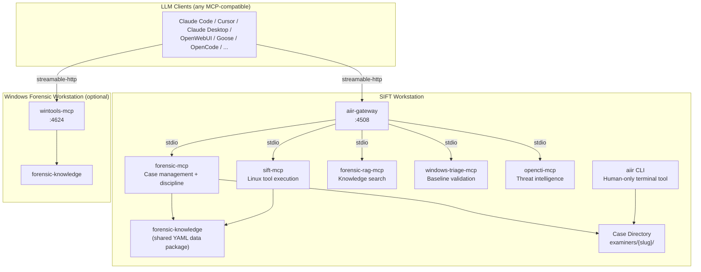
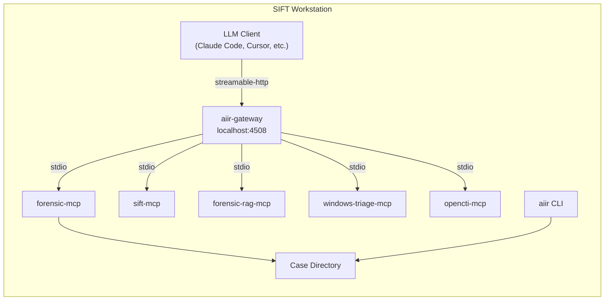
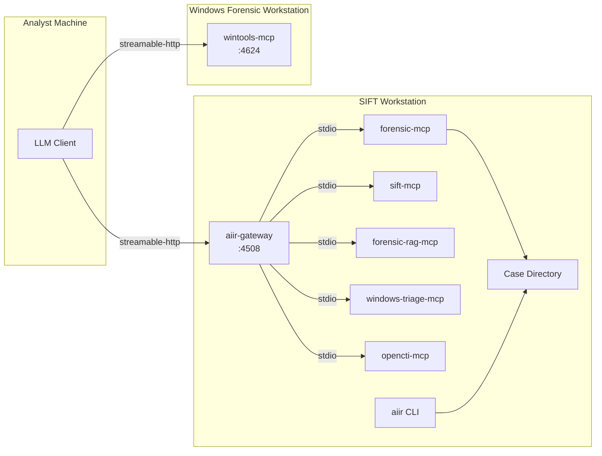
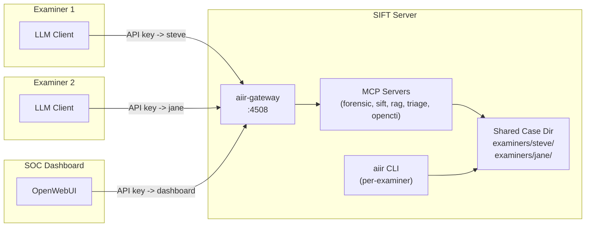
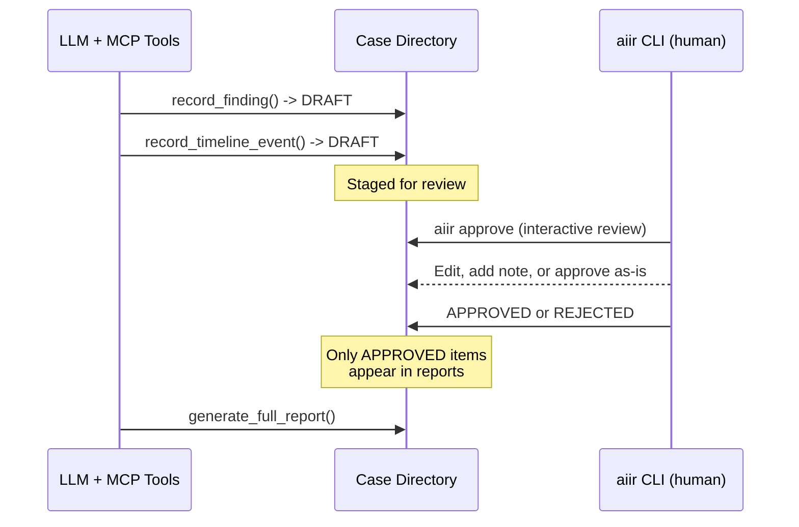

# AIIR CLI

Command-line interface for **human-in-the-loop forensic investigation management**. The `aiir` CLI runs on the SIFT workstation and provides the actions that only a human examiner should perform: approving findings, rejecting conclusions, managing evidence integrity, executing forensic commands with audit trails, and configuring the investigation platform.

This is a human-only tool. It reads input from `/dev/tty` and cannot be driven by an AI orchestrator. Every approval, rejection, and command execution is logged with examiner identity, timestamp, and OS user.

## Quick Start

```bash
git clone https://github.com/AppliedIR/aiir.git
cd aiir
python3 -m venv .venv && source .venv/bin/activate
pip install -e .

# Set your identity
aiir config --examiner "your.name"

# Initialize a case
aiir case init "Ransomware Investigation"

# Review staged findings
aiir approve
```

## Overview

The AI assistant (via forensic-mcp) stages findings and timeline events as DRAFT. The `aiir` CLI is how a human examiner reviews, approves, or rejects those items. The CLI and forensic-mcp share the same case directory on disk (`examiners/{slug}/` structure). This separation is structural -- the AI cannot approve its own work.

**Key Capabilities:**

- **Interactive Review** -- Walk through each staged item with approve/edit/note/reject/todo/skip options
- **Finding Modification** -- Edit AI-generated findings via `$EDITOR`, add examiner notes, override interpretations
- **Team Review** -- Filter by creator examiner, review only findings or timeline events
- **Investigation TODOs** -- Create and manage action items with assignee, priority, and finding links
- **Evidence Management** -- Register evidence files (SHA256 + read-only), lock/unlock evidence directories
- **Forensic Execution** -- Run commands with interactive /dev/tty confirmation, audit trail, and case context
- **Platform Setup** -- Detect locally installed MCPs and generate gateway stdio configs (`aiir setup`), or generate Streamable HTTP client configs for LLM clients (`aiir setup client`)
- **Examiner Identity** -- Configurable identity resolution with `AIIR_EXAMINER` env var, `--examiner` flag, config file, or OS user fallback
- **Approval PIN** -- Optional PBKDF2-hashed PIN per examiner, with lockout after 3 failed attempts

## Platform Architecture

AIIR is an LLM-agnostic forensic investigation platform built on the Model Context Protocol (MCP). The components can be deployed in several configurations depending on team size, workstation setup, and LLM client preference. Any MCP-compatible orchestrator works -- Claude Code, Cursor, Claude Desktop, OpenWebUI, Goose, OpenCode, and others.

### Component Map



LLM clients connect via Streamable HTTP -- to the gateway on the SIFT workstation for all SIFT-resident tools, and directly to wintools-mcp on Windows. The gateway manages SIFT MCPs as stdio subprocesses internally. wintools-mcp is an independent server on the Windows workstation and is not managed by the gateway.

The `aiir` CLI is a local terminal tool on the SIFT machine. It shares the case directory with forensic-mcp on disk. It does not connect to the gateway or any network endpoint.

### Deployment Topologies

#### Solo Analyst on SIFT

One examiner, one SIFT workstation. The LLM client connects to the gateway via Streamable HTTP on localhost.



Setup: `aiir setup client --sift=http://127.0.0.1:4508 -y`

#### SIFT + Windows Forensic Workstation

Two machines: a SIFT workstation running the gateway and a Windows machine running wintools-mcp. The LLM client connects to both independently via Streamable HTTP.



Setup: `aiir setup client --sift=SIFT_IP:4508 --windows=WIN_IP:4624`

#### Multi-Examiner Team

Multiple examiners share a case through the gateway. Each examiner has a unique API key that maps to their identity. All examiners work in isolated `examiners/{slug}/` directories. Read operations merge from all examiners for team visibility.



Setup: `aiir case init "Investigation" --collaborative`, then each examiner runs `aiir setup client --sift=SERVER:4508`.

### Human-in-the-Loop Workflow

All findings and timeline events are staged as DRAFT by the AI. Only a human examiner can approve or reject them via the `aiir` CLI. This is a structural guarantee -- the CLI reads confirmation from `/dev/tty`, which the AI cannot control.



### Case Directory Structure

```
cases/INC-2026-0219/
├── CASE.yaml                    # Case metadata (name, mode, team)
├── evidence/                    # Original evidence (read-only after registration)
├── extracted/                   # Extracted artifacts
├── reports/                     # Generated reports
└── examiners/
    ├── steve/                   # Examiner "steve"
    │   ├── findings.json        # Findings (DRAFT -> APPROVED/REJECTED)
    │   ├── timeline.json        # Timeline events
    │   ├── todos.json           # Investigation TODOs
    │   ├── evidence.json        # Evidence registry
    │   ├── actions.jsonl        # Investigative actions (append-only)
    │   ├── evidence_access.jsonl # Chain-of-custody log
    │   ├── approvals.jsonl      # Approval audit trail
    │   └── audit/
    │       ├── forensic-mcp.jsonl
    │       ├── sift-mcp.jsonl
    │       ├── exec.jsonl
    │       └── ...
    └── jane/                    # Examiner "jane" (same structure)
        └── ...
```

## Commands

### setup client

Generate LLM client configuration pointing at AIIR endpoints. All entries use `type: streamable-http` -- the client connects to gateway and wintools-mcp over HTTP, not stdio.

```bash
# Interactive wizard
aiir setup client

# Non-interactive with switches
aiir setup client \
    --client=claude-code \
    --sift=http://192.168.1.10:4508 \
    --windows=192.168.1.20:4624 \
    --examiner=steve \
    -y

# Local-only (no Windows)
aiir setup client --sift=http://127.0.0.1:4508 -y

# Exclude optional external MCPs
aiir setup client --no-zeltser -y
```

Supported clients:

| Client | Config file | Extras |
|--------|-------------|--------|
| Claude Code | `.mcp.json` | Copies `AGENTS.md` as `CLAUDE.md` |
| Claude Desktop | `~/.config/claude/claude_desktop_config.json` | -- |
| Cursor | `.cursor/mcp.json` | Copies `AGENTS.md` as `.cursorrules` |
| Other | `aiir-mcp-config.json` | Manual integration |

Optional endpoints: `--windows` (wintools-mcp), `--remnux` (REMnux MCP). The Zeltser IR Writing MCP is included by default; use `--no-zeltser` to exclude it.

The wizard auto-detects a local gateway at `http://127.0.0.1:4508` if running.

### setup

Detect locally installed MCP servers on the SIFT workstation and generate stdio configuration for the gateway. This is distinct from `setup client`, which generates Streamable HTTP configs for LLM clients.

```bash
# Interactive setup (detect MCPs, configure credentials, select clients, generate configs)
aiir setup

# Non-interactive (detect + generate Claude Code config only)
aiir setup --non-interactive

# Test MCP server connectivity (import check for each detected module)
aiir setup test
```

Setup phases:
1. **Detect** -- Finds installed MCP servers (system Python and venvs under `/opt/aiir`, `~/aiir`, `~/air-design`)
2. **Credentials** -- Configures OpenCTI URL/token, REMnux host (if applicable)
3. **Client Selection** -- Choose Claude Code, Cursor, Claude Desktop, and/or OpenWebUI/gateway
4. **Generate** -- Writes `.mcp.json`, `claude_desktop_config.json`, `gateway.yaml`, etc.

All generated config files are written with `0o600` permissions to avoid leaking credentials.

### approve

Interactive review with per-item options:

```bash
# Interactive review -- walk through each DRAFT item
aiir approve
#   [a]pprove  [e]dit & approve  [n]ote & approve
#   [r]eject   [t]odo            [s]kip  [q]uit

# Approve specific IDs
aiir approve F-001 F-002 T-001

# Approve with examiner note
aiir approve F-001 --note "Finding correct. Malware family unconfirmed."

# Approve with field override
aiir approve F-001 --interpretation "Process masquerading confirmed, no lateral movement"

# Approve with $EDITOR (opens finding as YAML for modification)
aiir approve F-001 --edit

# Team review: filter by creator examiner
aiir approve --by jane

# Review only findings (skip timeline events)
aiir approve --findings-only

# Review only timeline events
aiir approve --timeline-only
```

Every approval requires confirmation via `/dev/tty` (or PIN if configured). When approving with modifications, original AI content is preserved in `examiner_modifications` for audit trail.

### reject

```bash
# Reject with reason
aiir reject F-003 --reason "Insufficient evidence for attribution"

# Reject multiple items
aiir reject F-003 T-002 --reason "Contradicted by memory analysis"
```

Rejection requires confirmation via `/dev/tty` (or PIN). The reason is recorded in both the finding and the approvals.jsonl audit trail.

### review

```bash
# Case summary (default: counts of findings, timeline, evidence, TODOs by status)
aiir review

# Findings summary table (ID, status, confidence, examiner, title)
aiir review --findings

# Full finding detail (all fields including IOCs, MITRE, approval timestamps)
aiir review --findings --detail

# Cross-check findings against approval records (detects status without matching record)
aiir review --findings --verify

# Extract IOCs from findings grouped by approval status
aiir review --iocs

# Timeline events (summary table or --detail for full view)
aiir review --timeline
aiir review --timeline --detail

# Evidence registry and access log
aiir review --evidence

# Audit trail from all examiners (last N entries, sorted chronologically)
aiir review --audit --limit 100

# Investigation TODOs (all examiners merged)
aiir review --todos
aiir review --todos --open
```

Review commands merge data from all `examiners/*/` directories, providing a unified team view with scoped IDs (e.g., `steve/F-001`, `jane/F-002`).

### todo

```bash
# List open TODOs
aiir todo

# List all TODOs including completed
aiir todo --all

# Filter by assignee
aiir todo --assignee jane

# Add a new TODO
aiir todo add "Run volatility on server-04 memory dump" --assignee jane --priority high --finding F-003

# Mark TODO as completed
aiir todo complete TODO-001

# Update a TODO
aiir todo update TODO-002 --note "Waiting on third party" --priority low
```

### exec

```bash
# Execute forensic command with audit trail
aiir exec --purpose "Extract MFT from image" -- fls -r -m / image.E01
```

Requires `/dev/tty` confirmation before executing. The command runs in the case directory with a 300-second timeout. Exit code, stdout line count, and stderr line count are logged to `audit/exec.jsonl`.

### evidence

```bash
# Register evidence file (SHA256 hash + chmod 444)
aiir register-evidence /path/to/image.E01 --description "Disk image from workstation"

# Lock evidence directory (all files chmod 444, directory chmod 555)
aiir lock-evidence

# Unlock evidence directory for new files (directory chmod 755, files remain 444)
aiir unlock-evidence
```

Evidence actions are logged to `evidence_access.jsonl` in the examiner's directory.

### case

```bash
# Initialize a new case (solo mode)
aiir case init "Ransomware Investigation"

# Initialize a collaborative case
aiir case init "Team Investigation" --collaborative

# Join an existing case as a new examiner
aiir case join --case-id INC-2026-02191200
```

Case init creates the directory structure (evidence/, extracted/, reports/, examiners/{slug}/) and writes CASE.yaml with case metadata. The case ID format is `INC-{year}-{MMDDHHmmss}`.

### sync

```bash
# Export your contributions as a JSON bundle
aiir sync export --file steve-bundle.json

# Import another examiner's contribution bundle
aiir sync import --file jane-bundle.json
```

Bundles include findings, timeline, TODOs, approvals, audit entries, and evidence manifests. Importing creates the remote examiner's directory under `examiners/` and adds them to the team list in CASE.yaml. You cannot import your own bundle.

### config

```bash
# Set examiner identity
aiir config --examiner "jane.doe"

# Show current configuration
aiir config --show

# Set approval PIN (PBKDF2-hashed, stored in ~/.aiir/config.yaml)
aiir config --setup-pin

# Reset approval PIN (requires current PIN)
aiir config --reset-pin
```

## Examiner Identity

Every approval, rejection, and execution is logged with examiner identity. Resolution order:

| Priority | Source | Example |
|----------|--------|---------|
| 1 | `--examiner` flag | `aiir approve --examiner jane.doe F-001` |
| 2 | `AIIR_EXAMINER` env var | `export AIIR_EXAMINER=jane.doe` |
| 3 | `AIIR_ANALYST` env var | Deprecated fallback |
| 4 | `~/.aiir/config.yaml` | `examiner: jane.doe` |
| 5 | OS username (fallback) | Warns if unconfigured |

The OS username is always captured alongside the explicit examiner identity for accountability. Examiner slugs are lowercase alphanumeric with hyphens, max 20 characters.

## Configuration

| Variable | Default | Description |
|----------|---------|-------------|
| `AIIR_EXAMINER` | (none) | Examiner identity for audit trail |
| `AIIR_ANALYST` | (none) | Deprecated alias for `AIIR_EXAMINER` |
| `AIIR_CASE_DIR` | (none) | Active case directory (absolute path) |
| `AIIR_CASES_DIR` | `cases` | Root directory for case storage |

Case resolution order: `--case` flag, `AIIR_CASE_DIR` env var, `.aiir/active_case` pointer file.

## Project Structure

```
aiir/
├── src/aiir_cli/
│   ├── __init__.py                  # Package version
│   ├── main.py                      # Entry point, argument parser, dispatch
│   ├── identity.py                  # Examiner identity resolution (5-level priority)
│   ├── case_io.py                   # Case file I/O (local + merged multi-examiner reads)
│   ├── approval_auth.py             # /dev/tty confirmation + PIN auth (PBKDF2, lockout)
│   ├── commands/
│   │   ├── approve.py               # Interactive review + specific-ID approval
│   │   ├── reject.py                # Reject with reason
│   │   ├── review.py                # Case summary, findings, timeline, audit, TODOs, IOCs
│   │   ├── execute.py               # Forensic command execution with audit
│   │   ├── evidence.py              # Lock/unlock/register evidence
│   │   ├── config.py                # Examiner identity and PIN configuration
│   │   ├── todo.py                  # TODO add/complete/update/list
│   │   ├── setup.py                 # SIFT-local MCP detection + gateway config generation
│   │   ├── client_setup.py          # LLM client config generation (streamable-http)
│   │   └── sync.py                  # Multi-examiner export/import bundles
│   └── setup/
│       ├── detect.py                # MCP server detection (system + venv scanning)
│       ├── wizard.py                # Interactive credential and client selection wizards
│       └── config_gen.py            # Config file generation (.mcp.json, gateway.yaml)
├── tests/                           # 141 tests
│   ├── test_identity.py             # Identity resolution (3 tests)
│   ├── test_approval_auth.py        # PIN and /dev/tty confirmation (19 tests)
│   ├── test_approve_reject.py       # Approval workflow: interactive + specific-ID (21 tests)
│   ├── test_case_io.py              # Case file I/O and multi-examiner merges (18 tests)
│   ├── test_review.py               # Review display modes (22 tests)
│   ├── test_execute.py              # Forensic command execution (2 tests)
│   ├── test_evidence_cmds.py        # Evidence management (3 tests)
│   ├── test_config.py               # Config command (3 tests)
│   ├── test_todo.py                 # TODO commands (10 tests)
│   ├── test_setup.py                # Setup wizard and config generation (20 tests)
│   └── test_client_setup.py         # Client config generation (20 tests)
├── pyproject.toml
└── README.md
```

## Development

```bash
# Install with dev dependencies
pip install -e ".[dev]"

# Run tests
pytest tests/ -v

# Run with coverage
pytest tests/ --cov=aiir_cli --cov-report=term-missing
```

Requires Python 3.10+. Runtime dependency: `pyyaml>=6.0`.

## Responsible Use

This tool exists because AI-assisted forensic analysis requires human oversight. The `aiir` CLI enforces that boundary.

- **Human authority is final.** The AI stages findings as DRAFT. Only a human examiner can approve or reject them. The CLI reads from `/dev/tty`, which cannot be piped or automated by the AI.
- **The examiner owns the work product.** Approving a finding means you have reviewed it, verified the evidence, and are prepared to stand behind the conclusion. AI assistance does not reduce your responsibility.
- **Every action is auditable.** Approvals, rejections, evidence access, and command execution are logged with examiner identity, OS user, and timestamp. The audit trail is the foundation of defensible forensic work.
- **AI is an assistive tool, not a replacement.** A trained examiner reviewing AI-proposed findings should apply the same critical thinking they would to any other tool output. Corroborate, verify, and document.

## Acknowledgments

Architecture and direction by Steve Anson. Implementation by Claude Code (Anthropic).

## License

MIT License. See [LICENSE](LICENSE) for details.
