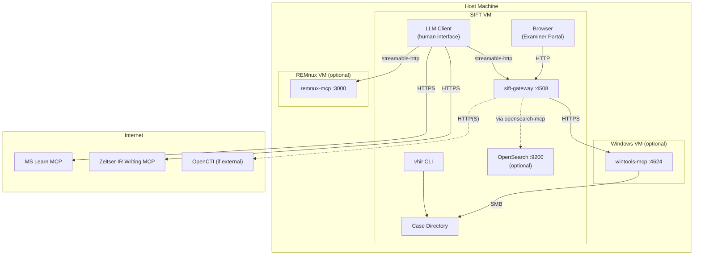
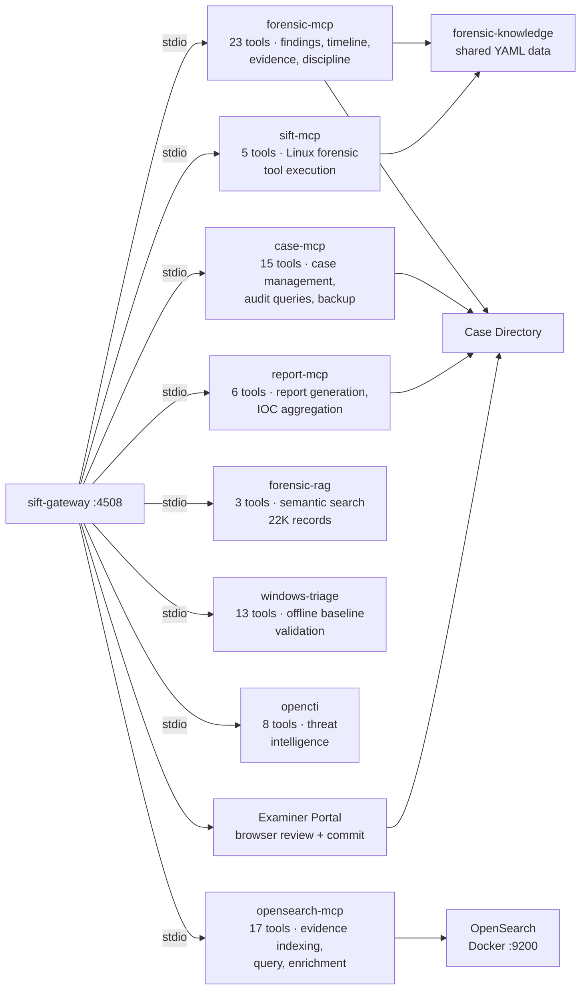
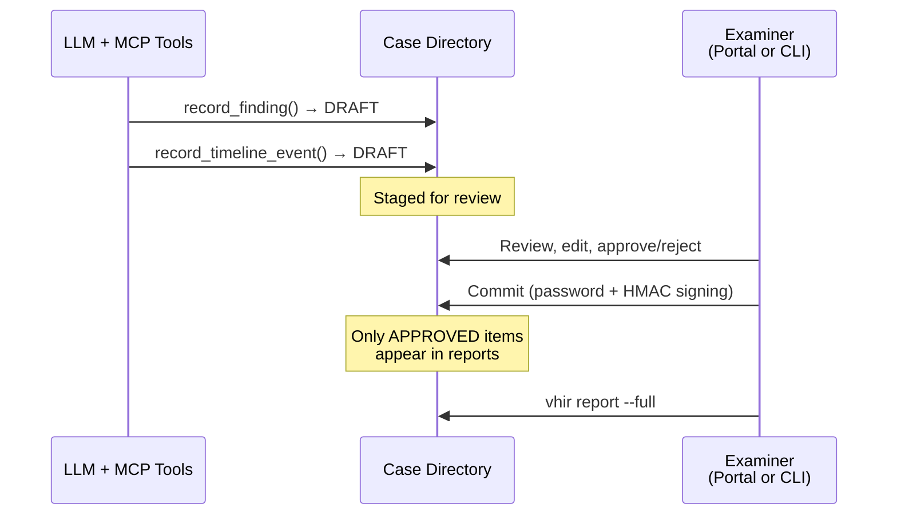
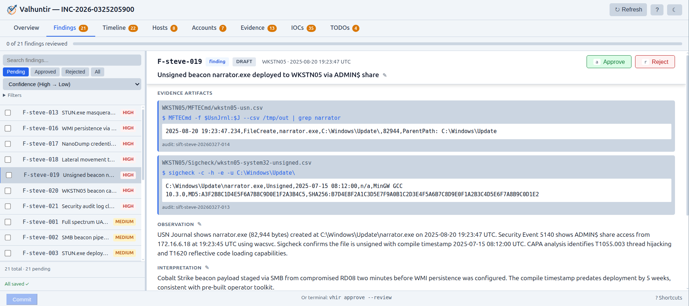
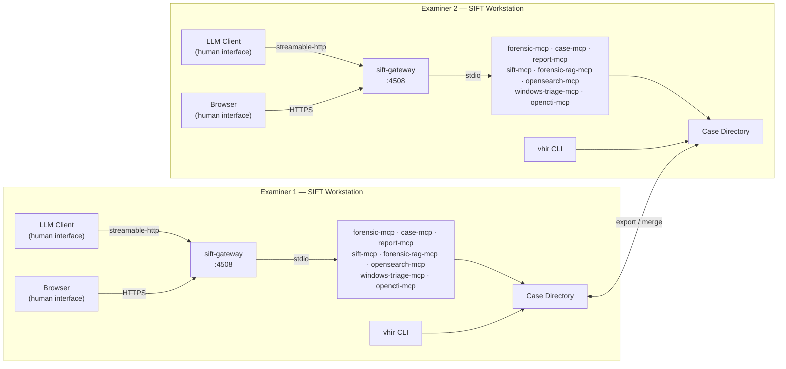
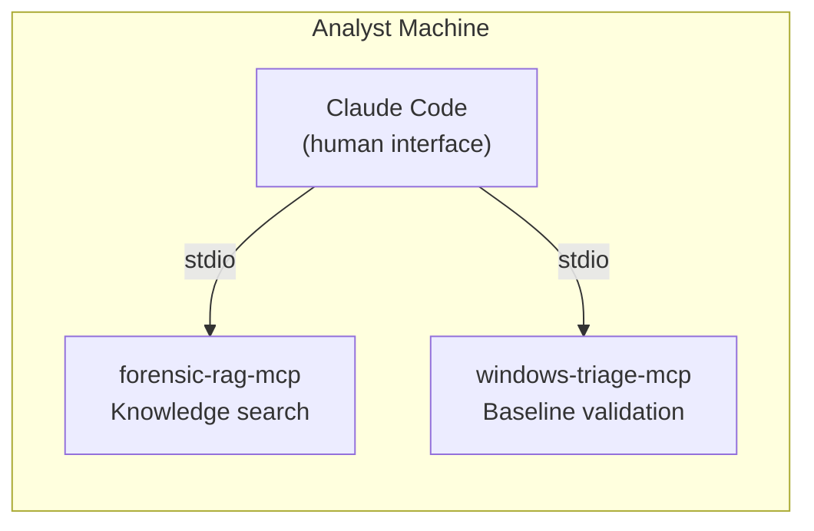
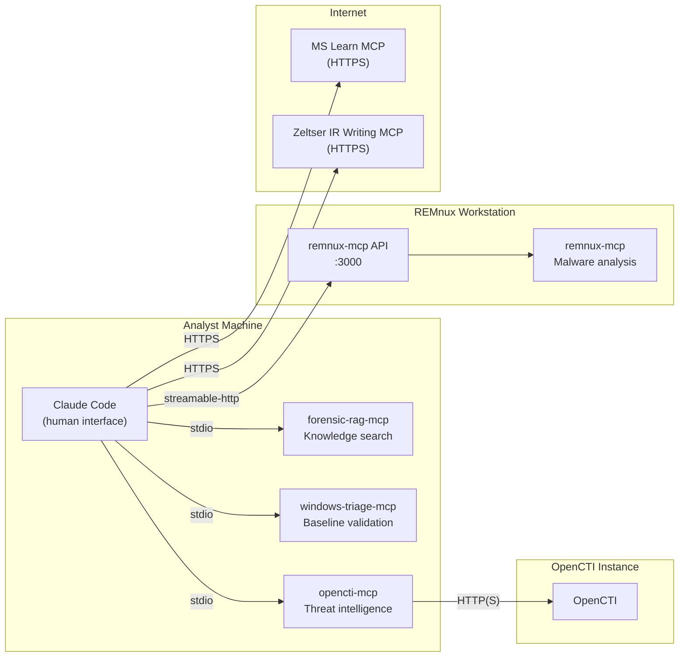

# Valhuntir
[](https://github.com/AppliedIR/Valhuntir/actions/workflows/ci.yml)
[](https://appliedir.github.io/Valhuntir/)
[](https://github.com/AppliedIR/Valhuntir/blob/main/LICENSE)

Valhuntir turns a single incident response analyst into the manager of an agentic AI incident response team. A host of MCP tools allows the AI to quickly ingest, process, and analyze massive amounts of digital forensic artifacts while keeping the human in control of the investigation and decision making process. Curated forensic knowledge bases, guidance and context hints, and processing suggestions are built into the system, but ultimately the human examiner drives the response.

**[Platform Documentation](https://appliedir.github.io/Valhuntir/)** ·
[CLI Reference](https://appliedir.github.io/Valhuntir/cli-reference/)

> **Important Note** — While extensively tested, this is a new platform.
> ALWAYS verify results and guide the investigative process. If you just
> tell Valhuntir to "Find Evil" it will more than likely hallucinate
> rather than provide meaningful results. The AI can accelerate, but the
> human must guide it and review all decisions.

## Valhuntir — AI-Assisted Forensic Investigation

Valhuntir ensures accountability and enforces human review of findings through cryptographic signing, password-gated approvals, and multiple layered controls.

Valhuntir is **LLM client agnostic** — connect any locally installed MCP-compatible client through the gateway. Supported clients include Claude Code, Claude Desktop, Cherry Studio, self-hosted LibreChat, and any client that supports Streamable HTTP transport with Bearer token authentication. The client must run on your machine or local network — cloud-hosted services cannot reach internal gateway addresses. Forensic discipline is provided structurally at the gateway and MCP layer, not through client-specific prompt engineering, so the same rigor applies regardless of which AI model or client drives the investigation.

> Looking for a simpler setup without the gateway or OpenSearch? See [Valhuntir Lite](#valhuntir-lite).

### Evidence Indexing with OpenSearch (Optional)

With [opensearch-mcp](https://github.com/AppliedIR/opensearch-mcp), evidence is parsed programmatically and indexed into OpenSearch, giving the LLM 17 purpose-built query tools instead of consuming billions of tokens reading raw artifacts. A 30-host triage collection with 50 million records becomes instantly searchable. Triage baseline and threat intelligence enrichment run programmatically — zero LLM tokens consumed.

15 parsers cover the forensic evidence spectrum: Windows Event Logs (evtx), 10 EZ Tool artifact types (Shimcache, Amcache, MFT, USN, Registry, Shellbags, Jumplists, LNK, Recyclebin, Timeline), Volatility 3 memory forensics, JSON/JSONL (Suricata, tshark, Velociraptor), delimited (CSV, TSV, Zeek, bodyfile, supertimelines), Apache/Nginx access logs, W3C (IIS, HTTPERR, Windows Firewall), Windows Defender MPLog, Scheduled Tasks XML, Windows Error Reporting, SSH auth logs, PowerShell transcripts, and Prefetch/SRUM (via Plaso or wintools-mcp).

Every parser produces deterministic content-based document IDs (re-ingest = zero duplicates), full provenance (`host.name`, `vhir.source_file`, `vhir.ingest_audit_id`), and proper `@timestamp` with timezone handling. Hayabusa auto-detection runs after EVTX ingest, applying 3,700+ Sigma rules and indexing alerts for structured querying.

### Investigation Workflow

1. **Create a case** — set case name, examiner identity, case directory
2. **Register evidence** — hash files, establish chain of custody
3. **Ingest and index** — parse evidence into OpenSearch for structured querying (or analyze files directly without OpenSearch)
4. **Scope the investigation** — review what's indexed, identify hosts and artifact types, check for Hayabusa detection alerts
5. **Enrich programmatically** — validate files/services against known-good baselines, check IOCs against threat intelligence (zero LLM tokens with opensearch-mcp)
6. **Search and analyze** — query across millions of records, aggregate patterns, build timelines
7. **Record findings** — LLM stages findings and timeline events as DRAFT with full evidence provenance
8. **Human review** — examiner approves or rejects each finding via the Examiner Portal or CLI (HMAC-signed)
9. **Generate report** — produce IR report from approved findings with MITRE mappings and IOC aggregation

Without OpenSearch, steps 3-6 are replaced by the LLM doing direct tool execution and analysis. Still very effective, but slower and with much higher token cost. Findings, timeline, approval workflow, and reporting are identical either way.

### Required Resources

| Component | Role | RAM (min) | RAM (rec) | Disk | Notes |
|-----------|------|-----------|-----------|------|-------|
| **Valhuntir with sift-mcp** | Gateway + 8 MCP backends | 16 GB | 16 GB | 50 GB + evidence/extractions | SIFT Workstation (Ubuntu). Gateway capped at 4 GB. 24 GB for memory analysis with Volatility 3. |
| **Valhuntir + OpenSearch** | Above + evidence indexing | 32 GB | 32 GB | 100 GB + evidence/extractions/indices | OpenSearch JVM 6 GB, container 8 GB. Can run on separate host. |
| **Valhuntir Lite** | Stdio MCPs only, no gateway | 8 GB | 16 GB | 30 GB + evidence/extractions | No OpenSearch. Direct MCP from LLM client. |
| **OpenSearch (remote)** | Dedicated indexing host | 12 GB | 16 GB | 100 GB + indices | Alternative to co-located. Connects via HTTPS. |
| **wintools-mcp** | Windows forensic tools | 8 GB | 16 GB | 60 GB | Separate Windows VM to run Windows-only tools. |
| **REMnux** | Malware analysis | 4 GB | 8 GB | 100 GB | Optional. Separate VM. [Docs](https://docs.remnux.org). |
| **OpenCTI** | Threat intelligence | 16 GB | 32 GB | 50 GB SSD | Optional. Separate host. [Docs](https://docs.opencti.io). |

## Platform Architecture

The examiner interacts with Valhuntir through three interfaces: the **LLM client** (AI-assisted investigation), the **Examiner Portal** (browser-based review and approval), and the **vhir CLI** (case management, evidence handling, and verification).

### Deployment Overview

The typical deployment runs three VMs on a single host: SIFT (primary workstation), REMnux (malware analysis), and Windows (forensic tool execution). The examiner works on the SIFT VM — running the LLM client, the Examiner Portal in a browser, and the vhir CLI. REMnux and Windows are headless worker VMs. All three communicate over a VM-local network. Internet access is through NAT for external MCP services.


```mermaid
graph TB
    subgraph host ["Host Machine"]
        subgraph sift ["SIFT VM"]
            CC["LLM Client<br/>(human interface)"]
            BR["Browser<br/>(Examiner Portal)"]
            CLI["vhir CLI"]
            GW["sift-gateway :4508"]
            OSD["OpenSearch :9200<br/>(optional)"]
            CASE["Case Directory"]

            CC -->|"streamable-http"| GW
            BR -->|"HTTP"| GW
            GW -.->|"via opensearch-mcp"| OSD
            CLI --> CASE
        end

        subgraph remnux ["REMnux VM (optional)"]
            RAPI["remnux-mcp :3000"]
        end

        subgraph winbox ["Windows VM (optional)"]
            WAPI["wintools-mcp :4624"]
        end

        CC -->|"streamable-http"| RAPI
        GW -->|"HTTPS"| WAPI
        WAPI -->|"SMB"| CASE
    end

    subgraph internet ["Internet"]
        ML["MS Learn MCP"]
        ZE["Zeltser IR Writing MCP"]
        OCTI["OpenCTI (if external)"]
    end

    CC -->|"HTTPS"| ML
    CC -->|"HTTPS"| ZE
    GW -.->|"HTTP(S)"| OCTI
```

REMnux, Windows, and OpenSearch are optional. SIFT alone provides 73 MCP tools across 7 backends (90 with opensearch-mcp, 100 with wintools-mcp), the Examiner Portal, and full case management.

### SIFT Platform Components

The sift-gateway aggregates up to 8 MCP backends as stdio subprocesses behind a single HTTP endpoint. Each backend is also available individually. The Examiner Portal is served by the gateway for browser-based review and approval. opensearch-mcp connects to a local or remote OpenSearch instance for evidence indexing and querying at scale.


```mermaid
graph LR
    GW["sift-gateway :4508"]

    FM["forensic-mcp<br/>23 tools · findings, timeline,<br/>evidence, discipline"]
    CM["case-mcp<br/>15 tools · case management,<br/>audit queries, backup"]
    RM["report-mcp<br/>6 tools · report generation,<br/>IOC aggregation"]
    SM["sift-mcp<br/>5 tools · Linux forensic<br/>tool execution"]
    RAG["forensic-rag<br/>3 tools · semantic search<br/>22K records"]
    WT["windows-triage<br/>13 tools · offline baseline<br/>validation"]
    OC["opencti<br/>8 tools · threat<br/>intelligence"]
    OS["opensearch-mcp<br/>17 tools · evidence indexing,<br/>query, enrichment"]
    CD["Examiner Portal<br/>browser review + commit"]
    FK["forensic-knowledge<br/>shared YAML data"]
    CASE["Case Directory"]
    OSD["OpenSearch<br/>Docker :9200"]

    GW -->|stdio| FM
    GW -->|stdio| CM
    GW -->|stdio| RM
    GW -->|stdio| SM
    GW -->|stdio| RAG
    GW -->|stdio| WT
    GW -->|stdio| OC
    GW -->|stdio| OS
    GW --> CD
    FM --> FK
    SM --> FK
    FM --> CASE
    CM --> CASE
    RM --> CASE
    CD --> CASE
    OS --> OSD
```

### Human-in-the-Loop Workflow

All findings and timeline events are staged as DRAFT by the AI. Only a human examiner can approve or reject them — via the Examiner Portal (browser) or the vhir CLI. Both paths produce identical HMAC-signed approval records. The AI cannot approve its own findings. MCP guidance provides reminders to the LLM to check in with the human frequently for review and guidance.


```mermaid
sequenceDiagram
    participant AI as LLM + MCP Tools
    participant Case as Case Directory
    participant Human as Examiner<br/>(Portal or CLI)

    AI->>Case: record_finding() → DRAFT
    AI->>Case: record_timeline_event() → DRAFT
    Note over Case: Staged for review

    Human->>Case: Review, edit, approve/reject
    Human->>Case: Commit (password + HMAC signing)

    Note over Case: Only APPROVED items<br/>appear in reports
    Human->>Case: vhir report --full
```

The **Examiner Portal** is the primary review interface with 8 tabs: Overview (investigation progress and getting started guide), Findings (the core review workflow with provenance chain display), Timeline (chronological events with a color-coded ruler), Hosts (systems involved, aggregated from findings), Accounts (user/service accounts involved), Evidence (registered files with SHA-256 integrity verification), IOCs (indicators extracted from findings with category/status filters), and TODOs (outstanding tasks).

Examiners review findings and timeline events, edit fields (confidence, justification, observation, interpretation, MITRE IDs, IOCs, tags), approve or reject items, and commit decisions — all in the browser. Each finding displays its evidence artifacts with a provenance chain showing which registered evidence files were input, which tools processed them, and what output was extracted. Keyboard shortcuts (`1`-`8` tabs, `j`/`k` navigate, `a` approve, `r` reject, `e` edit, `Shift+C` commit) enable fast review. The sidebar is resizable, and search matches across title, observation, host, and account fields. Light and dark themes are supported.

The Commit button (`Shift+C`) uses challenge-response authentication: the browser derives a PBKDF2 key from the examiner's password and proves knowledge via HMAC — the password never leaves the browser. Timeline events auto-created from findings follow the finding's approval status unless manually edited. IOCs auto-extracted from findings cascade when all source findings reach the same status. The CLI's `vhir approve` provides the same functionality from the terminal. Open the portal with `vhir portal`.

Examiners review findings in the Examiner Portal — validating artifacts, observations, and interpretations, with the full command audit trail from original evidence to final result.



The timeline view places findings and other observables in chronological context across the investigation.


### Forensic Knowledge Reinforcement

Valhuntir reinforces forensic discipline through multiple layers built into the MCP servers, client configuration, and gateway — not through a single system prompt that the LLM can drift from during long sessions.

**Forensic Knowledge (FK) package** — A shared YAML data package (`forensic-knowledge`) used by forensic-mcp and sift-mcp. Contains tool catalogs with forensic context (caveats, common mistakes, interpretation guidance), artifact descriptions, and discipline rules. When sift-mcp executes a forensic tool, the FK package enriches the response with tool-specific guidance — the LLM receives not just the output but context on how to interpret it correctly. This is injected at the MCP response level, not in the system prompt, so it arrives exactly when the LLM needs it.

**Rotating discipline reminders** — Each sift-mcp tool response includes a rotating forensic discipline reminder selected from the FK rules. These are short, contextual nudges ("Evidence guides theory, never the reverse", "Absence of evidence is not evidence of absence", etc.) that reinforce methodology throughout the session without consuming a fixed block of the context window. forensic-mcp reinforces discipline through finding validation — when the LLM records a finding, the server checks it against methodology standards and returns actionable feedback.

**MCP server instructions** — Each MCP server provides structured instructions via the MCP protocol's `instructions` field, delivered during session initialization. These describe the server's tools, expected workflows, and constraints. The gateway aggregates instructions from all backends into a single coherent briefing.

**Client configuration** — For Claude Code, `vhir setup client` deploys `CLAUDE.md` (investigation rules and MCP backend descriptions), `FORENSIC_DISCIPLINE.md` (evidence standards, confidence levels, checkpoint requirements), and `TOOL_REFERENCE.md` (tool selection workflows and score interpretation) as persistent context. `AGENTS.md` (MCP server descriptions, recording requirements, provenance rules, adversarial evidence handling) is deployed as a rules file for Claude Code and is available for other MCP clients to load as project instructions. For clients that don't support project instructions, the MCP server instructions delivered via the protocol carry the core guidance.

**Forensic RAG** — The `forensic-rag-mcp` server provides semantic search across 22,000+ records from 23 authoritative sources: Sigma rules, MITRE ATT&CK techniques, MITRE D3FEND countermeasures, Atomic Red Team tests, KAPE targets, Velociraptor artifacts, forensic artifact definitions, LOLBAS/LOLDrivers, CISA KEV, and more. The LLM queries this during investigation to ground its analysis in authoritative references rather than training data.

**Windows triage baseline** — The `windows-triage-mcp` server provides offline validation against 2.6 million known Windows file and process baseline records. The LLM can check whether a file, service, scheduled task, or registry entry is expected, suspicious, or unknown — without any network call.

These layers work together: FK enriches tool responses in real-time, discipline reminders maintain methodology awareness, server instructions establish workflow expectations, client docs provide persistent reference, and RAG + triage provide authoritative knowledge on demand. No single layer is sufficient alone — the reinforcement comes from consistent, contextual repetition across all interaction surfaces.

### Where Things Run

| Component | Runs on | Port | Purpose |
|-----------|---------|------|---------|
| sift-gateway | SIFT | 4508 | Aggregates SIFT-local MCPs behind one HTTP endpoint |
| forensic-mcp | SIFT | (via gateway) | Findings, timeline, evidence, TODOs, IOCs, discipline (23 tools) |
| case-mcp | SIFT | (via gateway) | Case management, audit queries, evidence registration, backup (15 tools) |
| report-mcp | SIFT | (via gateway) | Report generation with profiles, IOC aggregation, MITRE mapping (6 tools) |
| sift-mcp | SIFT | (via gateway) | Denylist-protected forensic tool execution on Linux/SIFT (5 tools) |
| opensearch-mcp | SIFT | (via gateway) | Evidence indexing, structured querying, enrichment (17 tools). Optional. |
| forensic-rag-mcp | SIFT | (via gateway) | Semantic search across Sigma, MITRE ATT&CK, Atomic Red Team, and more (3 tools) |
| windows-triage-mcp | SIFT | (via gateway) | Offline Windows baseline validation (13 tools) |
| opencti-mcp | SIFT | (via gateway) | Threat intelligence from OpenCTI (8 tools) |
| OpenSearch | SIFT (Docker) | 9200 | Evidence search engine. Local or remote. Optional. |
| Examiner Portal | SIFT | (via gateway) | 8-tab browser UI: overview, findings with provenance chains, timeline with ruler, hosts, accounts, evidence verification, IOCs, TODOs. Primary review UI. |
| wintools-mcp | Windows | 4624 | Catalog-gated forensic tool execution on Windows (10 tools) |
| vhir CLI | SIFT | -- | Human-only: case init, evidence management, verification, exec. Approval also available via Examiner Portal. Remote examiners need SSH only for CLI-exclusive operations. |
| forensic-knowledge | anywhere | -- | Shared YAML data package (tools, artifacts, discipline) |

The gateway exposes each backend as a separate MCP endpoint. Clients can connect to the aggregate endpoint or to individual backends:

```
http://localhost:4508/mcp              # Aggregate (all tools)
http://localhost:4508/mcp/forensic-mcp
http://localhost:4508/mcp/case-mcp
http://localhost:4508/mcp/report-mcp
http://localhost:4508/mcp/sift-mcp
http://localhost:4508/mcp/opensearch-mcp
http://localhost:4508/mcp/windows-triage-mcp
http://localhost:4508/mcp/forensic-rag-mcp
http://localhost:4508/mcp/opencti-mcp
```

#### Multi-Examiner Team


```mermaid
graph LR
    subgraph e1 ["Examiner 1 — SIFT Workstation"]
        CC1["LLM Client<br/>(human interface)"]
        BR1["Browser<br/>(human interface)"]
        CLI1["vhir CLI"]
        GW1["sift-gateway<br/>:4508"]
        MCPs1["forensic-mcp · case-mcp · report-mcp<br/>sift-mcp · forensic-rag-mcp · opensearch-mcp<br/>windows-triage-mcp · opencti-mcp"]
        CASE1["Case Directory"]

        CC1 -->|"streamable-http"| GW1
        BR1 -->|"HTTPS"| GW1
        GW1 -->|stdio| MCPs1
        MCPs1 --> CASE1
        CLI1 --> CASE1
    end

    subgraph e2 ["Examiner 2 — SIFT Workstation"]
        CC2["LLM Client<br/>(human interface)"]
        BR2["Browser<br/>(human interface)"]
        CLI2["vhir CLI"]
        GW2["sift-gateway<br/>:4508"]
        MCPs2["forensic-mcp · case-mcp · report-mcp<br/>sift-mcp · forensic-rag-mcp · opensearch-mcp<br/>windows-triage-mcp · opencti-mcp"]
        CASE2["Case Directory"]

        CC2 -->|"streamable-http"| GW2
        BR2 -->|"HTTPS"| GW2
        GW2 -->|stdio| MCPs2
        MCPs2 --> CASE2
        CLI2 --> CASE2
    end

    CASE1 <-->|"export / merge"| CASE2
```

### Case Directory Structure

```
cases/INC-2026-0219/
├── CASE.yaml                    # Case metadata (name, status, examiner)
├── evidence/                    # Original evidence (read-only after registration)
├── extractions/                 # Extracted artifacts
├── reports/                     # Generated reports
├── findings.json                # F-alice-001, F-alice-002, ...
├── timeline.json                # T-alice-001, ...
├── todos.json                   # TODO-alice-001, ...
├── iocs.json                    # IOC-alice-001, ... (auto-extracted from findings)
├── evidence.json                # Evidence registry
├── actions.jsonl                # Investigative actions (append-only)
├── evidence_access.jsonl        # Chain-of-custody log
├── approvals.jsonl              # Approval audit trail
├── pending-reviews.json         # Portal edits awaiting approval
└── audit/
    ├── forensic-mcp.jsonl
    ├── sift-mcp.jsonl
    ├── claude-code.jsonl       # PostToolUse hook captures (Claude Code only)
    └── ...
```

### External Dependencies

- **Zeltser IR Writing MCP** — Required for report generation. Configured automatically by `vhir setup client`. URL: https://website-mcp.zeltser.com/mcp (HTTPS, no auth)

## Quick Start

### SIFT Workstation

Requires Python 3.10+ and sudo access. The installer handles everything: MCP servers, gateway, vhir CLI, HMAC verification ledger, examiner identity, and LLM client configuration. When you select Claude Code, additional forensic controls are deployed (kernel-level sandbox, case data deny rules, PreToolUse guard hook, PostToolUse audit hook, provenance enforcement, password-gated human approval with HMAC signing). Other clients get MCP config only.

**Quick** — Core platform only, no databases (~70 MB):

```
curl -fsSL https://raw.githubusercontent.com/AppliedIR/sift-mcp/main/quickstart.sh -o /tmp/vhir-quickstart.sh && bash /tmp/vhir-quickstart.sh
```

**Recommended** — Adds the RAG knowledge base (22,000+ records from 23 authoritative sources) and Windows triage databases (2.6M baseline records), downloaded as pre-built snapshots. Requires ~14 GB disk space:

- ~7 GB — ML dependencies (PyTorch, CUDA) required by the RAG embedding model
- ~6 GB — Windows triage baseline databases (2.6M rows, decompressed)
- ~1 GB — RAG index, source code, and everything else

```
curl -fsSL https://raw.githubusercontent.com/AppliedIR/sift-mcp/main/quickstart.sh -o /tmp/vhir-quickstart.sh && bash /tmp/vhir-quickstart.sh --recommended
```

**Recommended with OpenSearch** — Everything above plus evidence indexing at scale. Parses and indexes evidence into OpenSearch, giving the LLM 17 structured query tools instead of reading raw artifacts. Requires Docker.

```
curl -fsSL https://raw.githubusercontent.com/AppliedIR/sift-mcp/main/quickstart.sh -o /tmp/vhir-quickstart.sh && bash /tmp/vhir-quickstart.sh --recommended --opensearch
```

**Custom** — Individual package selection, OpenCTI integration, or remote access with TLS:

```
git clone https://github.com/AppliedIR/sift-mcp.git && cd sift-mcp
./setup-sift.sh
```

### Windows Forensic Workstation (optional)

```
# Option 1: git clone
git clone https://github.com/AppliedIR/wintools-mcp.git; cd wintools-mcp

# Option 2: download ZIP (no git required)
Invoke-WebRequest https://github.com/AppliedIR/wintools-mcp/archive/refs/heads/main.zip -OutFile wintools.zip
Expand-Archive wintools.zip -DestinationPath .; cd wintools-mcp-main
```

Then run the installer:

```
.\scripts\setup-windows.ps1
```

## Security Considerations

All Valhuntir components are assumed to run on a private forensic network, protected by firewalls, and not exposed to incoming connections from the Internet or potentially hostile systems. The design assumes dedicated, isolated systems are used throughout.

Any data loaded into the system or its component VMs, computers, or instances runs the risk of being exposed to the underlying AI. Only place data on these systems that you are willing to send to your AI provider.

Outgoing Internet connections are required for report generation (Zeltser IR Writing MCP) and optionally used for threat intelligence (OpenCTI) and documentation (MS Learn MCP). No incoming connections from external systems should be allowed.

Valhuntir is designed so that AI interactions flow through MCP tools, enabling security controls and audit trails. Clients with direct shell access (like Claude Code) can also operate outside MCP, but `vhir setup client` deploys forensic controls for Claude Code: a kernel-level sandbox restricts Bash writes, deny rules block Edit/Write to case data files, a PreToolUse hook guards against Bash redirections to protected files, a PostToolUse hook captures every Bash command to the audit trail, provenance enforcement ensures findings are traceable to evidence, and an HMAC verification ledger provides cryptographic proof that approved findings haven't been tampered with. Valhuntir is not designed to defend against a malicious AI or to constrain the AI client that you deploy.

## Commands

Most `vhir` CLI operations have MCP equivalents via case-mcp, forensic-mcp, and report-mcp. When working with an MCP-connected client, you can ask the AI to handle case management, evidence registration, report generation, and more — the AI operates through audited MCP tools rather than direct CLI invocation.

The commands below require the examiner's password and are intentional human-in-the-loop checkpoints. The password is the security gate — without it, no findings can be approved or rejected regardless of the client or access method.

### Human-Only Commands (require password)

These commands require password entry that the AI cannot supply. This is by design — the examiner must authenticate to approve, reject, or commit findings.

#### approve

```
vhir approve                                             # Interactive review of all DRAFT items
vhir approve F-alice-001 F-alice-002 T-alice-001         # Approve specific IDs
vhir approve F-alice-001 --edit                          # Edit in $EDITOR before approving
vhir approve F-alice-001 --note "Malware family unconfirmed"  # Approve with examiner note
vhir approve --by jane                                   # Filter to IDs with jane's examiner prefix
vhir approve --findings-only                             # Skip timeline events
vhir approve --timeline-only                             # Skip findings
vhir approve --review                                    # Apply pending portal edits
```

Requires the examiner's password. Approved findings are HMAC-signed with a PBKDF2-derived key. The `--review` flag applies edits made in the Examiner Portal (stored in `pending-reviews.json`), recomputes content hashes and HMAC signatures, then removes the pending file. Alternatively, use the portal's Commit button (Shift+C) which performs the same operation via challenge-response authentication — the password never leaves the browser.

#### reject

```
vhir reject F-alice-003 --reason "Insufficient evidence for attribution"
vhir reject F-alice-003 T-alice-002 --reason "Contradicted by memory analysis"
vhir reject --review                                     # Interactive walk-through of DRAFT items
```

Requires the examiner's password.

#### exec

```
vhir exec --purpose "Extract MFT from image" -- fls -r -m / image.E01
```

Requires terminal confirmation. Logged to `audit/cli-exec.jsonl`. Use this for manual tool execution with audit trail when not operating through MCP.

#### evidence unlock

```
vhir unlock-evidence                       # Directory chmod 755, files remain 444
vhir evidence unlock
```

Requires terminal confirmation. Unlocking evidence allows writes to the evidence directory.

#### Password management

```
vhir config --setup-password               # Set approval password (PBKDF2-hashed, min 8 chars)
vhir config --reset-password               # Reset password (requires current, re-signs ledger)
```

Password entry uses masked input. The AI cannot supply the password.

#### HMAC verification

```
vhir review --verify                       # Cross-check content hashes + HMAC verification
vhir review --verify --mine                # HMAC verification for current examiner only
```

Requires the examiner's password to derive the HMAC key and confirm integrity. `--verify` also works with `--findings` (`vhir review --findings --verify`).

### All Commands

The remaining commands can also be performed through MCP tools (case-mcp, forensic-mcp, report-mcp) when working with an MCP-connected client. The CLI equivalents are listed here for reference and for use outside MCP sessions.

#### portal

```
vhir portal                                              # Open the Examiner Portal in your browser
```

Opens the Examiner Portal for the active case. The portal is the primary review interface — examiners can review, edit, approve, reject, and commit findings entirely in the browser. Use the Commit button (Shift+C) to apply decisions with challenge-response authentication. Alternatively, `vhir approve --review` applies pending edits from the CLI.

#### backup

```
vhir backup /path/to/destination                         # Back up case data (interactive)
vhir backup /path/to/destination --all                   # Include evidence + extractions
vhir backup /path/to/destination --include-evidence      # Include evidence files
vhir backup /path/to/destination --include-extractions   # Include extraction files
vhir backup --verify /path/to/backup/                    # Verify backup integrity
```

Creates a timestamped backup with SHA-256 manifest. Verification checks every file hash against the manifest. The `--all` flag includes evidence and extraction files (which can be large). Without flags, interactive mode prompts per category with size estimates.

#### case

```
vhir case init "Ransomware Investigation"                # Create a new case
vhir case activate INC-2026-02191200                     # Set active case
vhir case close INC-2026-02191200                        # Close a case by ID
vhir case reopen INC-2026-02191200                       # Reopen a closed case
vhir case list                                           # List available cases
vhir case status                                         # Show active case summary
vhir case migrate                                        # Migrate to flat layout (see below)
```

#### review

```
vhir review                                # Case summary (counts by status)
vhir review --findings                     # Findings table
vhir review --findings --detail            # Full finding detail
vhir review --iocs                         # IOCs grouped by approval status
vhir review --timeline                     # Timeline events
vhir review --timeline --status APPROVED   # Filter timeline by status
vhir review --timeline --start 2026-01-01 --end 2026-01-31   # Filter by date range
vhir review --timeline --type execution    # Filter by event type
vhir review --evidence                     # Evidence registry and access log
vhir review --audit --limit 100            # Audit trail (last N entries)
vhir review --todos --open                 # Open TODOs
```

#### todo

```
vhir todo                                                          # List open TODOs
vhir todo --all                                                    # Include completed
vhir todo add "Run volatility on server-04" --assignee jane --priority high --finding F-alice-003
vhir todo complete TODO-alice-001
vhir todo update TODO-alice-002 --note "Waiting on third party" --priority low
```

#### evidence

```
vhir evidence register /path/to/image.E01 --description "Disk image"
vhir evidence list
vhir evidence verify
vhir evidence log [--path <filter>]
vhir evidence lock                         # All files chmod 444, directory chmod 555
vhir evidence unlock
```

Legacy aliases (`vhir register-evidence`, `vhir lock-evidence`, `vhir unlock-evidence`) still work.

#### export / merge

```
vhir export --file steve-findings.json      # Export findings for sharing
vhir merge --file jane-findings.json        # Merge another examiner's findings
```

#### report

```
vhir report --full [--save <path>]
vhir report --executive-summary [--save <path>]
vhir report --timeline [--from <date> --to <date>] [--save <path>]
vhir report --ioc [--save <path>]
vhir report --findings F-alice-001,F-alice-002 [--save <path>]
vhir report --status-brief [--save <path>]
```

#### audit

```
vhir audit log [--limit 100] [--mcp sift-mcp] [--tool run_command]
vhir audit summary
```

#### service

```
vhir service status                    # Show running backends + health
vhir service start forensic-rag        # Start a backend
vhir service stop windows-triage       # Stop a backend
vhir service restart sift-mcp          # Restart a backend
```

#### case migrate

```
vhir case migrate                                      # Migrate primary examiner data to flat layout
vhir case migrate --examiner alice                     # Specify examiner
vhir case migrate --import-all                         # Merge all examiners' data
```

#### config

```
vhir config --examiner "jane-doe"          # Set examiner identity
vhir config --show                         # Show current configuration
```

#### update

```
vhir update                       # Pull latest, reinstall, redeploy, restart
vhir update --check               # Check for updates without applying
vhir update --no-restart          # Skip gateway restart after update
```

#### join

```
vhir join --sift SIFT_URL --code CODE                            # Join from remote machine using join code
vhir join --sift SIFT_URL --code CODE --wintools                 # Join as wintools machine (registers backend)
```

Exchange a one-time join code for gateway credentials. Run on the remote machine (analyst laptop or Windows forensic workstation). The join code is generated on SIFT via `vhir setup join-code`. Credentials are saved to `~/.vhir/config.yaml` with restricted permissions (0600).

#### setup

```
vhir setup client                          # Interactive client configuration (recommended)
vhir setup test                            # Test MCP server connectivity
```

#### setup client

Generate Streamable HTTP config for your LLM client:

```
vhir setup client                                                          # Interactive wizard
vhir setup client --client=claude-code --sift=http://127.0.0.1:4508 -y    # Local solo
vhir setup client --sift=SIFT_IP:4508 --windows=WIN_IP:4624               # SIFT + Windows
```

For remote orchestrator setups (Path 2), remote examiners run a platform-specific setup script that creates a `~/vhir/` workspace with MCP config, forensic controls, and discipline docs:

```
# Linux
curl -sSL https://raw.githubusercontent.com/AppliedIR/Valhuntir/main/setup-client-linux.sh \
  | bash -s -- --sift=https://SIFT_IP:4508 --code=XXXX-XXXX

# macOS
curl -sSL https://raw.githubusercontent.com/AppliedIR/Valhuntir/main/setup-client-macos.sh \
  | bash -s -- --sift=https://SIFT_IP:4508 --code=XXXX-XXXX
```

```
# Windows
Invoke-WebRequest -Uri https://raw.githubusercontent.com/AppliedIR/Valhuntir/main/setup-client-windows.ps1 -OutFile setup-client-windows.ps1
.\setup-client-windows.ps1 -Sift https://SIFT_IP:4508 -Code XXXX-XXXX
```

Always launch your LLM client from `~/vhir/` or a subdirectory. Forensic controls only apply when started from within the workspace. To uninstall, re-run the setup script with `--uninstall` (Linux/macOS) or `-Uninstall` (Windows).

Claude Desktop's config file supports stdio transport only. The [mcp-remote](https://www.npmjs.com/package/mcp-remote) bridge is used to connect to the gateway. `vhir setup client --client=claude-desktop` generates the correct mcp-remote config automatically.

| Client | Platforms | Config file | Extras |
|--------|-----------|-------------|--------|
| Claude Code | Linux, macOS, Windows | `~/vhir/.mcp.json` or `~/.claude.json` (SIFT) | `CLAUDE.md`, `settings.json`, sandbox, audit hooks |
| Claude Desktop | macOS, Windows | `claude_desktop_config.json` (see note) | Requires mcp-remote bridge. Project instructions from AGENTS.md |
| Cherry Studio | Linux, macOS, Windows | JSON import (manual) | `baseUrl` field, `streamableHttp` type (camelCase) |
| LibreChat | Any (browser) | `librechat.yaml` (`mcpServers` section) | Valhuntir generates `librechat_mcp.yaml` reference to merge |
| Other | Any | `vhir-mcp-config.json` | Manual integration |

Claude Code on Windows requires Git for Windows (provides Git Bash) or WSL. Claude Desktop is not available on Linux and requires the [mcp-remote](https://www.npmjs.com/package/mcp-remote) bridge (stdio-only config). Config paths: `~/Library/Application Support/Claude/claude_desktop_config.json` (macOS), `%APPDATA%\Claude\claude_desktop_config.json` (Windows). Any MCP client that supports Streamable HTTP transport with Bearer token authentication will work — the gateway is not client-specific.

## Examiner Identity

Every approval, rejection, and command execution is logged with examiner identity. Resolution order:

| Priority | Source | Example |
|----------|--------|---------|
| 1 | `--examiner` flag | `vhir approve --examiner jane-doe F-jane-001` |
| 2 | `VHIR_EXAMINER` env var | `export VHIR_EXAMINER=jane-doe` |
| 3 | `~/.vhir/config.yaml` | `examiner: jane-doe` |
| 4 | `VHIR_ANALYST` env var | Deprecated fallback |
| 5 | OS username | Warns if unconfigured |

## Repo Map

| Repo | Purpose |
|------|---------|
| [sift-mcp](https://github.com/AppliedIR/sift-mcp) | Monorepo: 11 SIFT packages (forensic-mcp, case-mcp, report-mcp, sift-mcp, sift-gateway, case-dashboard, forensic-knowledge, forensic-rag, windows-triage, opencti, sift-common) |
| [opensearch-mcp](https://github.com/AppliedIR/opensearch-mcp) | Evidence indexing + querying via OpenSearch (17 tools, 15 parsers). Optional. |
| [wintools-mcp](https://github.com/AppliedIR/wintools-mcp) | Windows forensic tool execution (10 tools, 31 catalog entries) |
| [Valhuntir](https://github.com/AppliedIR/Valhuntir) | CLI, architecture reference |

## Updating

### Valhuntir

```
vhir update              # Pull latest code, reinstall packages, redeploy controls, restart gateway
vhir update --check      # Check for updates without applying
vhir update --no-restart # Update without restarting the gateway
```

The update command pulls the latest code from all configured repos (sift-mcp, vhir,
opensearch-mcp, wintools-mcp), reinstalls all packages, redeploys forensic controls,
restarts the gateway, and runs a connectivity smoke test.

## Valhuntir Lite

In its simplest form, Valhuntir Lite provides Claude Code with forensic knowledge and instructions on how to enforce forensic rigor, present findings for human review, and audit actions taken. MCP servers enhance accuracy by providing authoritative information — a forensic knowledge RAG and a Windows triage database — plus optional OpenCTI threat intelligence and REMnux malware analysis.

**Quick** — Forensic discipline, MCP packages, and config. No databases (<70 MB):

```
git clone https://github.com/AppliedIR/sift-mcp.git
cd sift-mcp
./quickstart-lite.sh --quick
```

**Recommended** — Adds the RAG knowledge base (22,000+ records from 23 authoritative sources) and Windows triage databases (2.6M baseline records). Requires ~14 GB disk space:

- ~7 GB — ML dependencies (PyTorch, CUDA) required by the RAG embedding model
- ~6 GB — Windows triage baseline databases (2.6M rows, decompressed)
- ~1 GB — RAG index, source code, and everything else

```
git clone https://github.com/AppliedIR/sift-mcp.git
cd sift-mcp
./quickstart-lite.sh
```

This one-time setup takes approximately 15-30 minutes depending on
internet speed and CPU. Subsequent runs reuse existing databases and index.

```
claude
/welcome
```

To update an existing Valhuntir Lite installation, re-run the installer from an updated clone:

```
cd sift-mcp
git pull
./quickstart-lite.sh
```

The installer is idempotent — it reuses the existing venv, skips databases
and RAG index if already present, and redeploys config files.

#### Lite Architecture


```mermaid
graph LR
    subgraph analyst ["Analyst Machine"]
        CC["Claude Code<br/>(human interface)"]
        FR["forensic-rag-mcp<br/>Knowledge search"]
        WTR["windows-triage-mcp<br/>Baseline validation"]

        CC -->|stdio| FR
        CC -->|stdio| WTR
    end
```

#### Lite with Optional Add-ons


```mermaid
graph LR
    subgraph analyst ["Analyst Machine"]
        CC["Claude Code<br/>(human interface)"]
        FR["forensic-rag-mcp<br/>Knowledge search"]
        WTR["windows-triage-mcp<br/>Baseline validation"]
        OC["opencti-mcp<br/>Threat intelligence"]

        CC -->|stdio| FR
        CC -->|stdio| WTR
        CC -->|stdio| OC
    end

    subgraph octi ["OpenCTI Instance"]
        OCTI[OpenCTI]
    end

    subgraph remnux ["REMnux Workstation"]
        RAPI["remnux-mcp API<br/>:3000"]
        RMX["remnux-mcp<br/>Malware analysis"]
        RAPI --> RMX
    end

    subgraph internet ["Internet"]
        ML["MS Learn MCP<br/>(HTTPS)"]
        ZE["Zeltser IR Writing MCP<br/>(HTTPS)"]
    end

    CC -->|"streamable-http"| RAPI
    CC -->|"HTTPS"| ML
    CC -->|"HTTPS"| ZE
    OC -->|"HTTP(S)"| OCTI
```

| Connection | Protocol | Notes |
|-----------|----------|-------|
| Claude Code → forensic-rag-mcp | stdio | Local Python process, always present |
| Claude Code → windows-triage-mcp | stdio | Local Python process, always present |
| Claude Code → opencti-mcp | stdio | Local Python process, connects out to OpenCTI via HTTP(S) |
| opencti-mcp → OpenCTI Instance | HTTP(S) | opencti-mcp runs locally, calls out to the OpenCTI server |
| Claude Code → remnux-mcp | streamable-http | Remote, on its own REMnux workstation |
| Claude Code → MS Learn MCP | HTTPS | `https://learn.microsoft.com/api/mcp` — streamable-http type in .mcp.json |
| Claude Code → Zeltser IR Writing MCP | HTTPS | `https://website-mcp.zeltser.com/mcp` — streamable-http type in .mcp.json |

No gateway, no sandbox, no deny rules. Claude runs forensic tools directly via Bash. Forensic discipline is suggested and reinforced via prompt hooks and reference documents, but Claude Code can choose to ignore them. See the [sift-mcp README](https://github.com/AppliedIR/sift-mcp#valhuntir-lite) for optional add-on install flags (`--opencti`, `--remnux`, `--mslearn`, `--zeltser`).

## Upgrading from Lite to Valhuntir

Both modes share the same Python venv, triage databases, and RAG index.
Valhuntir adds the gateway (up to 8 MCP backends behind one HTTP endpoint),
4+ additional MCP servers (forensic-mcp, case-mcp, report-mcp, sift-mcp,
and optionally opensearch-mcp), a web-based review portal (Examiner Portal),
structured case management, sandbox enforcement, and HMAC-signed approvals.

To upgrade, run `setup-sift.sh` from your existing sift-mcp clone. The
installer reuses the existing venv and databases. Lite case data (markdown
files) does not auto-migrate to Valhuntir case data (structured JSON) — start
fresh or transfer findings manually.

## Evidence Handling

Never place original evidence on any Valhuntir system. Only use working copies for which verified originals or backups exist. Valhuntir workstations process evidence through AI-connected tools, and any data loaded into these systems may be transmitted to the configured AI provider. Treat all Valhuntir systems as analysis environments, not evidence storage.

Evidence integrity is verified by SHA-256 hashes recorded at registration. Examiners can optionally lock evidence to read-only via `vhir evidence lock`. Proper evidence integrity depends on verified hashes, write blockers, and chain-of-custody procedures that exist outside this platform.

Case directories can reside on external or removable media. ext4 is preferred for full permission support. NTFS and exFAT are acceptable but file permission controls (read-only protection) will be silently ineffective. FAT32 is discouraged due to the 4 GB file size limit.

## Responsible Use and Legal

While steps have been taken to enforce human-in-the-loop controls, it is ultimately the responsibility of each examiner to ensure that their findings are accurate and complete. The AI, like a hex editor, is a tool to be used by properly trained incident response professionals. Users are responsible for ensuring their use complies with applicable laws, regulations, and organizational policies. Use only on systems and data you are authorized to analyze.

This software is provided "as is" without warranty of any kind. See [LICENSE](LICENSE) for full terms.

MITRE ATT&CK is a registered trademark of The MITRE Corporation. SIFT Workstation is a product of the SANS Institute.

## Acknowledgments

Architecture and direction by Steve Anson. Implementation by Claude Code (Anthropic).

## Clear Disclosure

I do DFIR. I am not a developer. This project would not exist without Claude Code handling the implementation. While an immense amount of effort has gone into design, testing, and review, I fully acknowledge that I may have been working hard and not smart in places. My intent is to jumpstart discussion around ways this technology can be leveraged for efficiency in incident response while ensuring that the ultimate responsibility for accuracy remains with the human examiner.

## License

MIT License - see [LICENSE](LICENSE)
